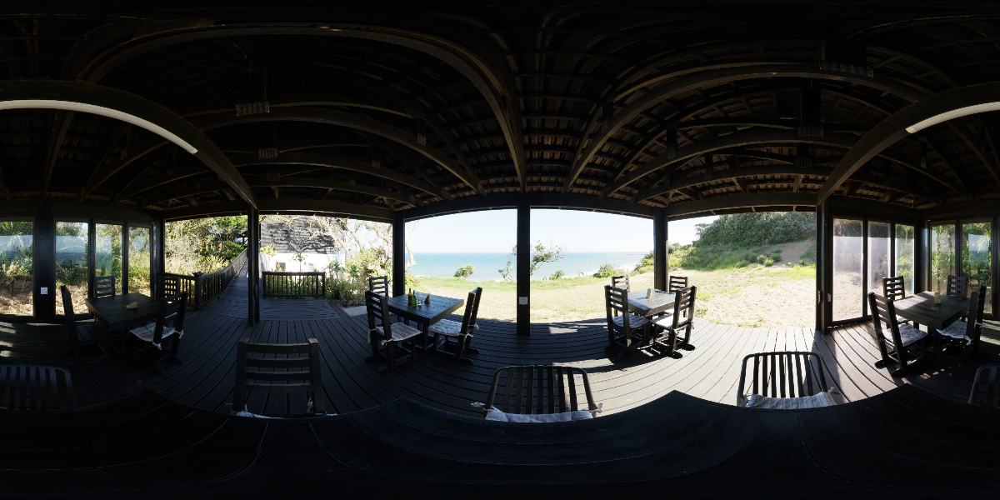
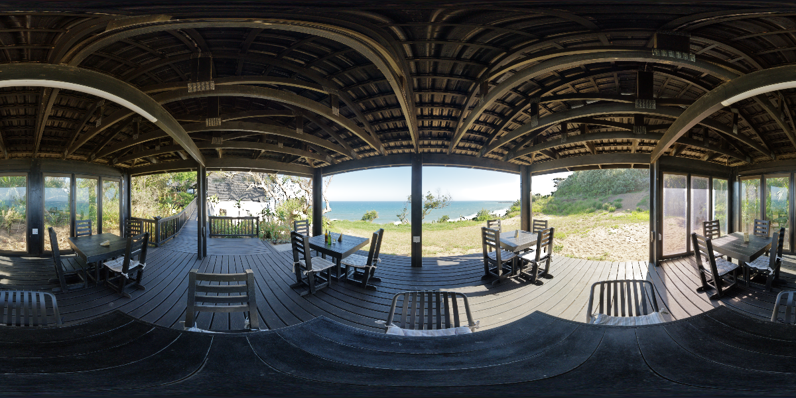
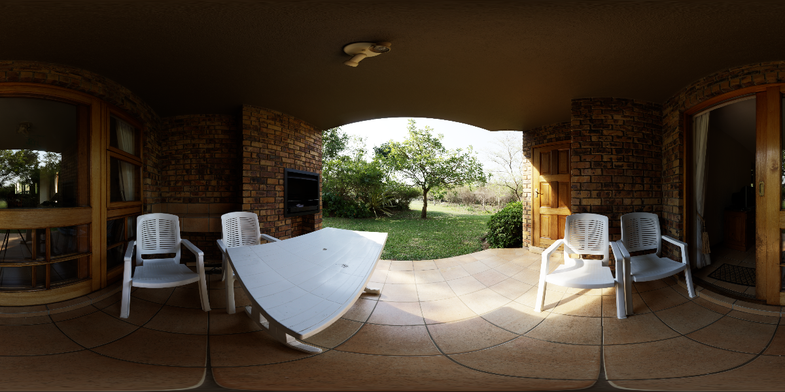
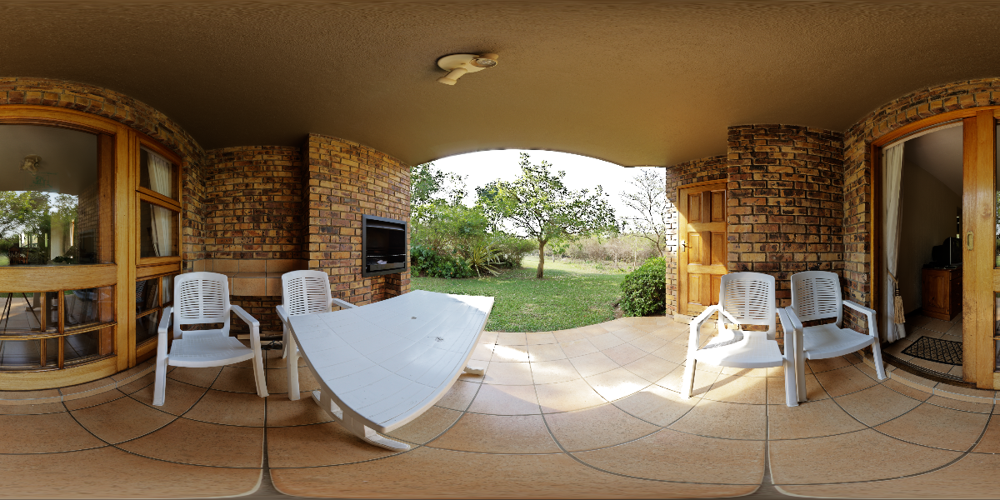

# Local Exposure

A three-exposure Fusion Local Exposure experiment built with **SlangPy + Slang**. It blends brightness across multiple scales, converts the result into local exposure, and applies it to the original HDR image before ACES Filmic tone mapping.

## Results

Each pair uses the same HDR image, global exposure, and ACES curve. Left: global exposure only. Right: local exposure enabled. Click an image to view it at full size.

| Global Exposure + ACES | Fusion Local Exposure + ACES |
| :---: | :---: |
|  |  |
|  |  |

Top: shadow detail in the deck roof and floor. Bottom: brightness changes in the veranda ceiling and brick walls.

**Example settings:** Highlight and Shadow Contrast Scale are both **0.5** (exposure offsets of ±3 EV), with Sigma = 0.2. Global exposure is −2 EV for the top pair and −1 EV for the bottom pair. These examples use a stronger adjustment than the application default of **0.8** to make the effect easier to see.

## Quick Start

Windows · Python 3.12 · GPU with D3D12 / Vulkan support.

```powershell
py -3.12 -m venv .venv
.\.venv\Scripts\python.exe -m pip install -r requirements.txt
.\run.ps1
```

Reproduce the deck example:

```powershell
.\run.ps1 --image Assets/sundowner_deck_4k.exr --exposure -2 --highlight-contrast 0.5 --shadow-contrast 0.5 --view compare
```

The View menu offers **Fusion Result / Original Comparison / Local Exposure EV**. Switch images and adjust exposure and weights interactively. **F5** reloads shaders, **F2** exports a PNG, and **Esc** exits.

| Parameter | Default | Description |
| --- | --- | --- |
| `--exposure` | 0 | Global exposure in EV |
| `--highlight-contrast` / `--shadow-contrast` | 0.8 / 0.8 | Each exposure offset has magnitude `6 × (1 − Scale)` EV; 1 means no offset |
| `--sigma` | 0.2 | Exposure weight width; smaller values make exposure selection more selective |
| `--levels` | 16 | Maximum pyramid levels, capped by the shorter working-image dimension |
| `--fusion-scale` | 4 | Resolution divisor per axis: 4 for guided quarter resolution, 1 for full reference |

## Implementation

`HDR → Three-exposure lightness and weights → Multiscale pyramids → Weighted Laplacian blending and coarse-to-fine reconstruction → Local exposure multiplier → HDR × Exposure → ACES → sRGB`

`shaders/pyramid.slang` generates lightness and weights. `shaders/fusion.slang` handles blending, reconstruction, and inverse exposure conversion. The implementation uses UE Fusion-style four-tap downsampling and exp2 weights. It extracts scalar luminance and uses a monotone Z curve fitted to the current tone operator's neutral response (ACES Filmic by default). This is not a full reproduction of UE FilmToneMap.

```powershell
.\.venv\Scripts\python.exe test_pyramid.py          # Numerical regression tests
.\.venv\Scripts\python.exe docs/render_examples.py  # Regenerate README comparisons
```

## Quarter-Resolution Fusion

By default, Fusion and inverse exposure conversion run at **1/4 width x 1/4 height** (1/16 as many pixels). A 4096x2048 input uses a 1024x512 working image. The UI's **Fusion resolution** selector switches between the guided version and the full-resolution reference; `--fusion-scale 1` selects the reference from the command line.

`shaders/guided.slang` downsamples linear HDR and log-luminance guidance separately, fits local `EV = a * guide + b` models in 5x5 low-resolution windows, averages the coefficients, and evaluates them with full-resolution guidance. Regularization is 0.04 EV squared, and the resulting local EV is limited to [-12, 12]. Only exposure application and the real tone mapper run at full resolution.

This is an approximation: averaging HDR before nonlinear tone mapping and omitting the finest Fusion bands can change fine detail and strong highlights. Guided upsampling reduces edge bleed but cannot recover information already lost during reduction. The lower working pixel count is not a measured 16x frame-time speedup; full-resolution output and guided-filter passes still have a cost.

```powershell
.\.venv\Scripts\python.exe -m unittest test_guided test_zcurve test_pyramid test_precision
```

## Fitted Z Curve and Inverse 1D LUT

On startup and **F5**, the GPU samples `shaders/tone_operator.slang` on neutral RGB `(L,L,L)` over [0,65535]. SciPy fits all four parameters of:

`f(L) = L^contrast / (b * L^(contrast * shoulder) + c)`

The constraints `contrast,b,c > 0` and `0 < shoulder <= 1` guarantee monotonicity. Shoulder is optimized, not fixed. The fit minimizes perceptual lightness error. Fusion uses `F(L) = sqrt(f(L))` for all three exposures, reconstructs lightness `S`, and computes `exposure = F_inverse(S) / L`, limited to +/-12 EV. Matched targets preserve identity, including black and domain-clamped highlights. Final HDR RGB still goes through the real operator.

The inverse is baked once into a **1024-entry R16F 1D LUT (2 KiB)**. It stores log2 luminance with logit-spaced lightness coordinates to resolve shadows and the shoulder. A shader performs one filtered lookup and exp2; there is no runtime bisection or 3D LUT. CPU numerical inversion runs only during calibration. Inputs and reconstructed targets clamp to the fitted domain endpoints; the proxy itself is not clipped to 1, which would destroy invertibility.

This models **neutral luminance**, not arbitrary RGB hue/saturation interactions. The operator must be spatially independent, black-preserving, and return finite linear SDR RGB in [0,1] with a monotone neutral response. Invalid or poorly fitted operators fail calibration; failed F5 reloads preserve the previous working shaders and curve. Measured errors are sampled checks, not universal bounds.

Current ACES fit: contrast **1.52577**, shoulder **0.999449**, b **1.00612**, c **0.210214**. Independent samples give luminance RMSE **0.00463**, maximum luminance error **0.01867**, and maximum lightness error **0.01024**. GPU round-trip error over [1e-8,65535] is about **0.0156 EV** across 32,768 samples (regression budget: **0.02 EV**).

```powershell
.\.venv\Scripts\python.exe zcurve.py       # Write outputs/zcurve/report.json
.\.venv\Scripts\python.exe test_zcurve.py  # Fit, inverse, operator, reload tests
```

Colors use RGBA16F and exposure maps use R16F. Guided sample products, regularized slope division, and display multiply/add operations use half. Curve evaluation, inverse lookup, sensitive Fusion calculations and guided accumulation/evaluation remain float. See the [precision review](docs/precision.md).

## References

- [Bart Wronski — Exposure Fusion: local tonemapping for real-time rendering](https://bartwronski.com/2022/02/28/exposure-fusion-local-tonemapping-for-real-time-rendering/): synthetic exposures, multiscale fusion, and applications in real-time rendering.
- [kbmajeed / exposure_fusion](https://github.com/kbmajeed/exposure_fusion): a reference implementation of Mertens et al.'s Exposure Fusion method, including weights and pyramid blending.
- **Unreal Engine source:** `Engine/Shaders/Private/PostProcessLocalExposure.usf`, used to compare Fusion parameter semantics and downsampling (requires access to the engine source).
- [Krzysztof Narkowicz — ACES Filmic Tone Mapping Curve](https://knarkowicz.wordpress.com/2016/01/06/aces-filmic-tone-mapping-curve/): the filmic curve approximation used in this project.
- [SlangPy documentation](https://slangpy.shader-slang.org/en/latest/): GPU compute, resources, and window APIs.

Example HDRIs are from Poly Haven under CC0: [Sundowner Deck / Dario Barresi](https://polyhaven.com/a/sundowner_deck) and [Veranda / Greg Zaal](https://polyhaven.com/a/veranda).
