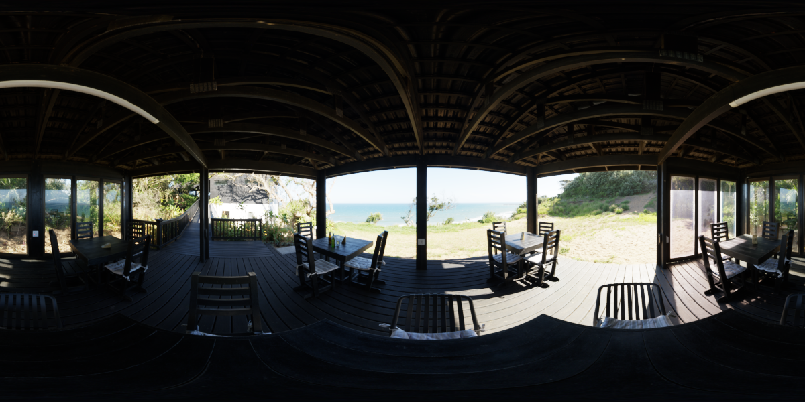
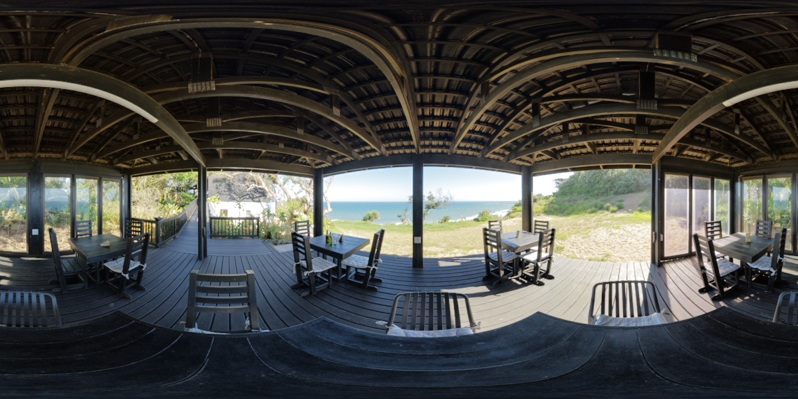
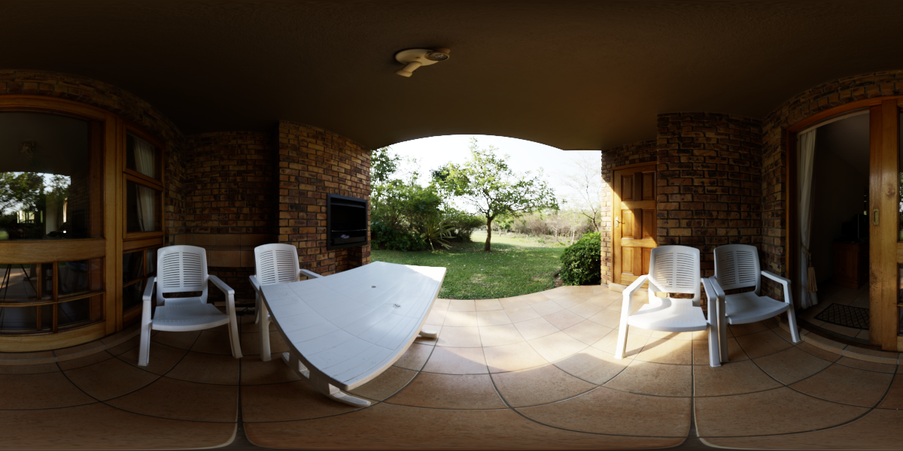
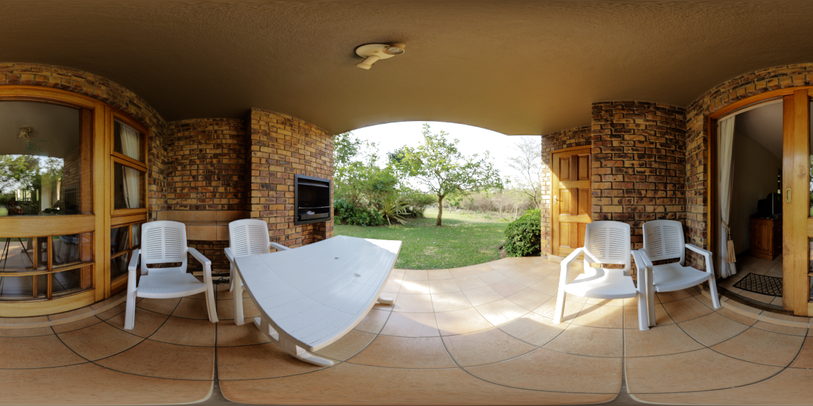
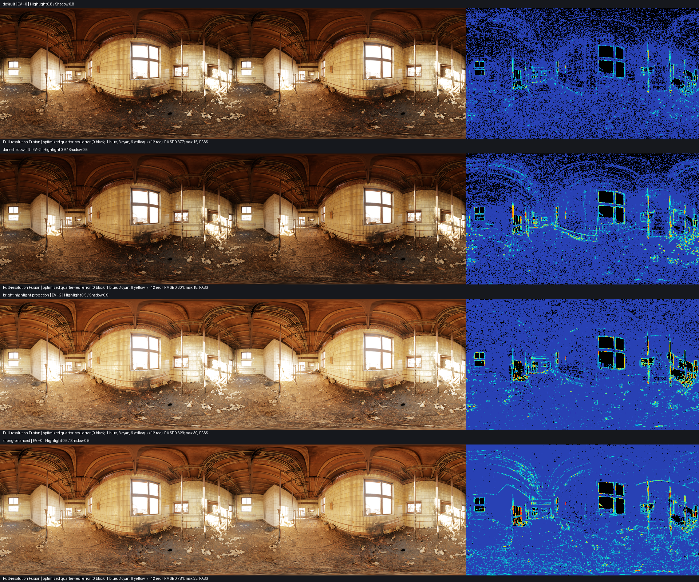
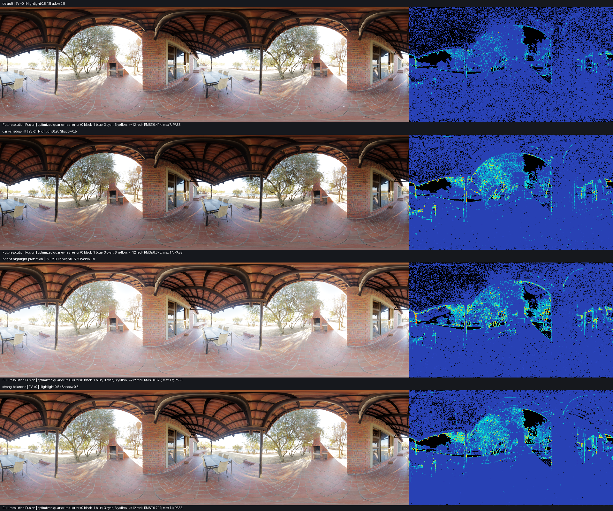
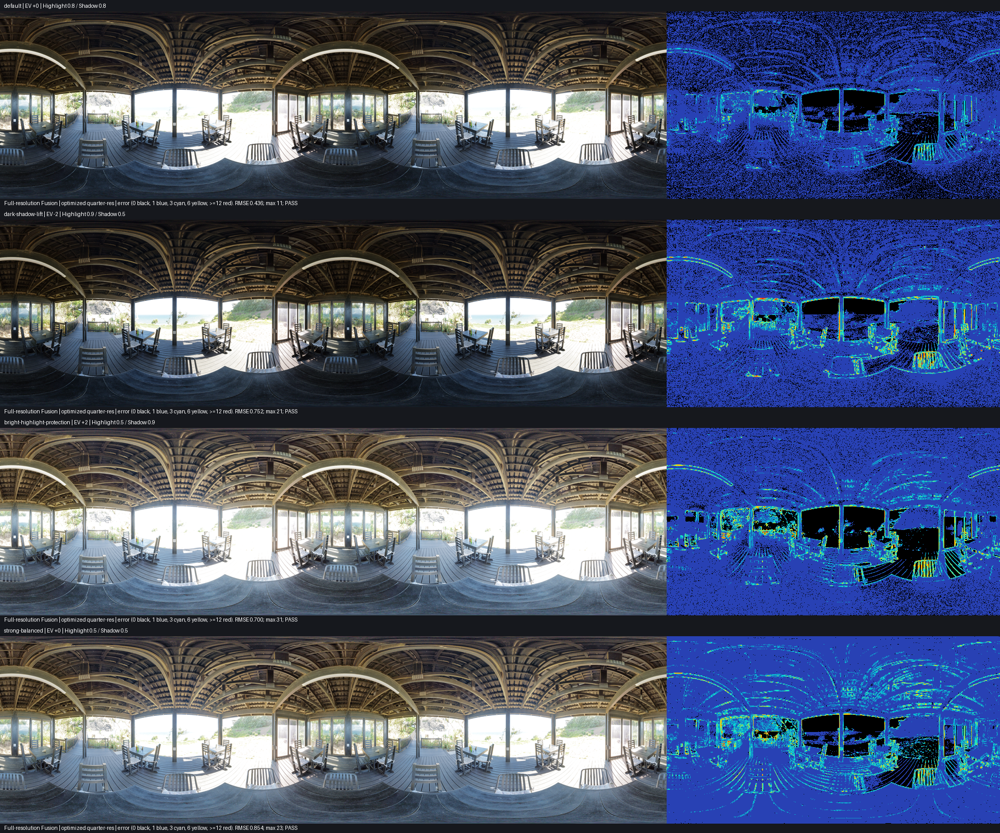
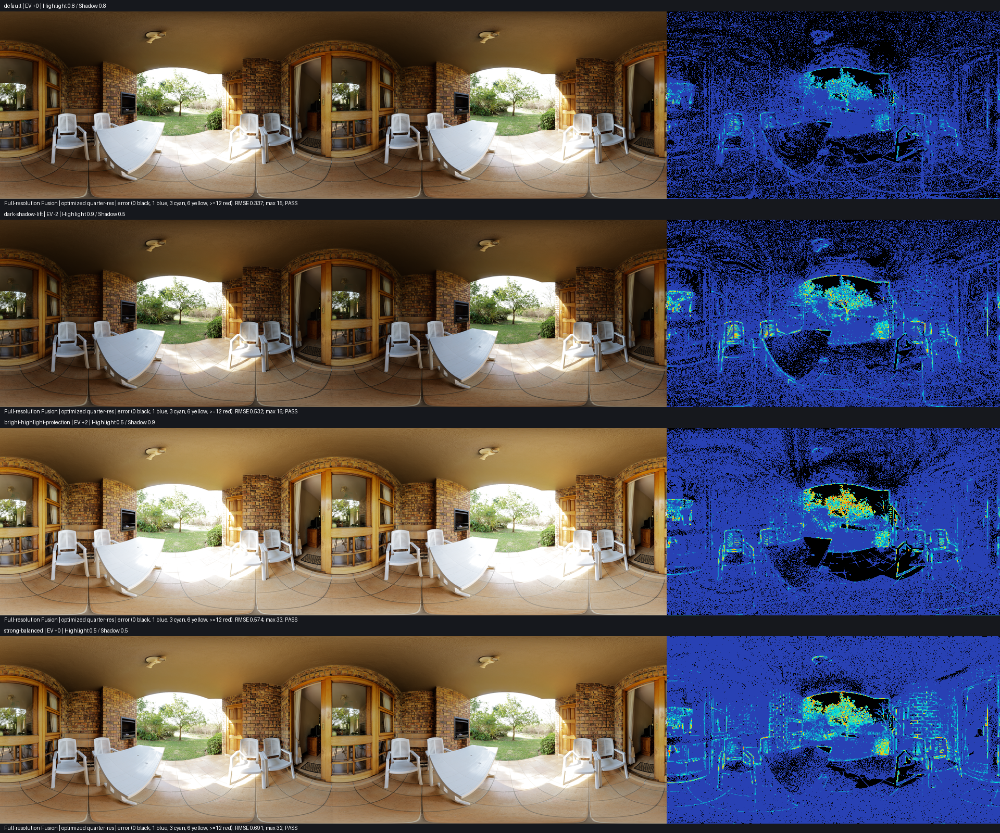

# Fusion Local Exposure

**Reveal shadow detail while keeping bright regions under control.** A GPU local-exposure pipeline built with SlangPy and Slang, from an interactive reference to an optimized mobile implementation.

| Global exposure + ACES | Fusion local exposure + ACES |
| :---: | :---: |
|  |  |
|  |  |

Each pair uses the same HDR input, global exposure, and tone mapper. Examples use ±3 EV brackets to emphasize the effect; the default is ±1.2 EV.

## What we built

Exposure fusion supplies the foundation. Our work focuses on turning it into a practical **HDR exposure adjustment** with a small mobile runtime:

- **Fuse lightness, apply exposure to HDR.** Blend three synthetic exposures across a Laplacian pyramid, reconstruct the desired lightness, then recover a local exposure multiplier. The final RGB image passes through the real tone mapper.
- **Calibrate the brightness response.** Fit a monotone Z curve to the tone mapper's neutral response and bake its inverse into a **2 KiB, 1024-entry R16F LUT**. Exposure recovery takes one filtered lookup instead of an iterative search. This approximates neutral luminance, not arbitrary color interactions.
- **Do the heavy work on 1/16 of the pixels.** Fusion runs at quarter width and height. A fine-residual correction restores full-resolution exposure detail before the inverse lookup.
- **Store exposure differences, preserve the baseline.** The optimized mobile graph keeps the middle-exposure lightness in FP32 and stores two signed differences in RG16F. Four bilinear source samples evaluate exposure and weights before averaging; packed intermediates and local reconstruction of three pyramid levels reduce memory traffic and synchronization.

## Optimized vs. full-resolution Fusion

**Full-resolution Fusion · Optimized quarter-resolution Fusion · Error**

Each scene covers four parameter presets, top to bottom: default, darker global exposure with stronger shadow lift, brighter global exposure with stronger highlight protection, and stronger balanced local exposure.

**Abandoned Tiled Room**



**Qwantani Patio**



**Sundowner Deck**



**Veranda**



Both paths use the same 1920×1080 HDR input and calibration. The independent reference runs Fusion at full resolution without Guided upsampling; the optimized path runs at quarter width and height with fine-residual correction. These comparisons include the quality cost of downsampling and upsampling. Error colors show the largest RGB difference in sRGB8 codes: black means identical, red means **12 or more**. Previews preserve peak errors.

**16/16 scene and parameter cases meet the red-area goal: less than 1% of native pixels at error ≥12.** The worst case occupies **0.02175%**. The error images use a fixed scale and peak-preserving previews, so their visible red area is not the measured native-pixel fraction. Extreme synthetic edges and uncorrelated HDR noise remain limitations; this is not a universal error bound.

[All settings and error metrics](docs/images/parameter-matrix/README.md) · [Full-size images and regeneration](docs/image-comparison.md)

## Try it

Windows or macOS

**Windows** (D3D12 or Vulkan)

```powershell
python -m venv .venv
.\.venv\Scripts\python.exe -m pip install -r requirements.txt
.\run.ps1 --view compare
```

**macOS**

```bash
python3 -m venv .venv
.venv/bin/python -m pip install -r requirements.txt
.venv/bin/python main.py --view compare
```

Switch HDR scenes, adjust exposure, and compare the result interactively. **F5** reloads shaders; **F2** saves an image.

The PC viewer remains the independent reference implementation. The optimized mobile graph runs initialization, pyramid downsampling, tail fusion, reconstruction, and full-resolution correction. Each stage declares its own resources. See the [stage guide](docs/implementation.md) and [Android benchmark](docs/performance/android.md).

[Pipeline and calibration details](docs/implementation.md) · [Developer documentation](docs/README.md)

## References

- [Bart Wronski — Exposure Fusion: local tonemapping for real-time rendering](https://bartwronski.com/2022/02/28/exposure-fusion-local-tonemapping-for-real-time-rendering/)
- [Mertens-style exposure fusion reference implementation](https://github.com/kbmajeed/exposure_fusion)
- Unreal Engine's `PostProcessLocalExposure.usf` — Fusion parameter semantics and pyramid downsampling.
- [Krzysztof Narkowicz — ACES Filmic Tone Mapping Curve](https://knarkowicz.wordpress.com/2016/01/06/aces-filmic-tone-mapping-curve/)
- [SlangPy](https://github.com/shader-slang/slangpy)

Example HDRIs: [Sundowner Deck / Dario Barresi](https://polyhaven.com/a/sundowner_deck) and [Veranda / Greg Zaal](https://polyhaven.com/a/veranda), via Poly Haven (CC0).
