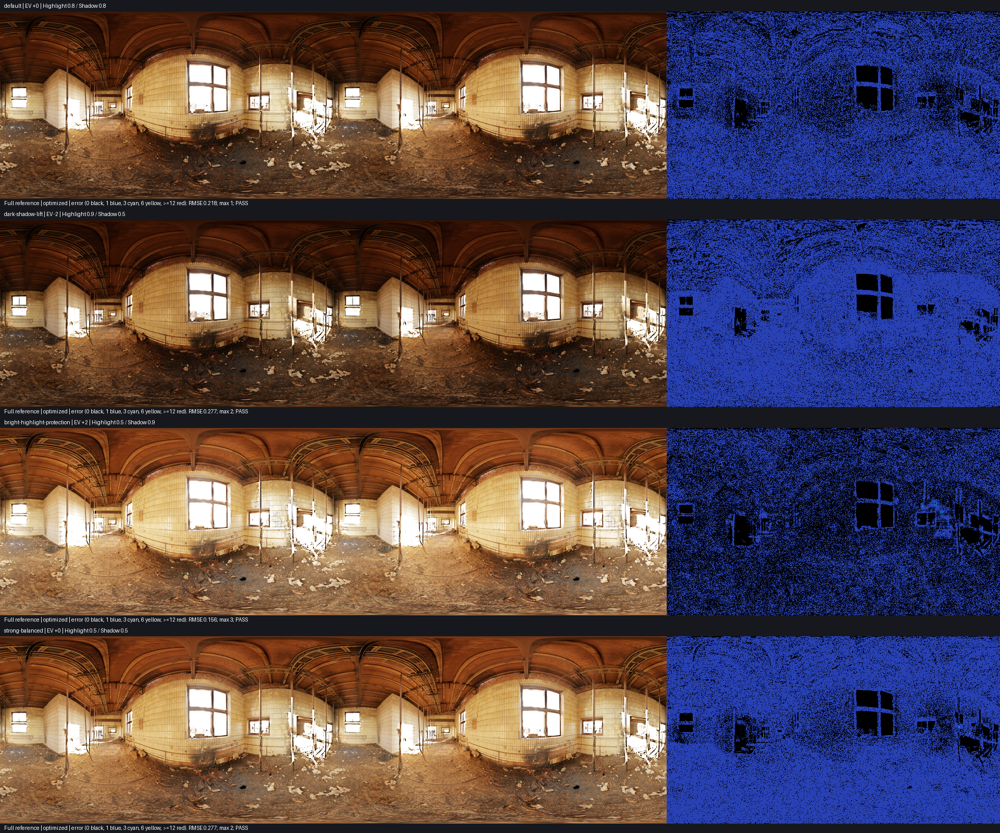
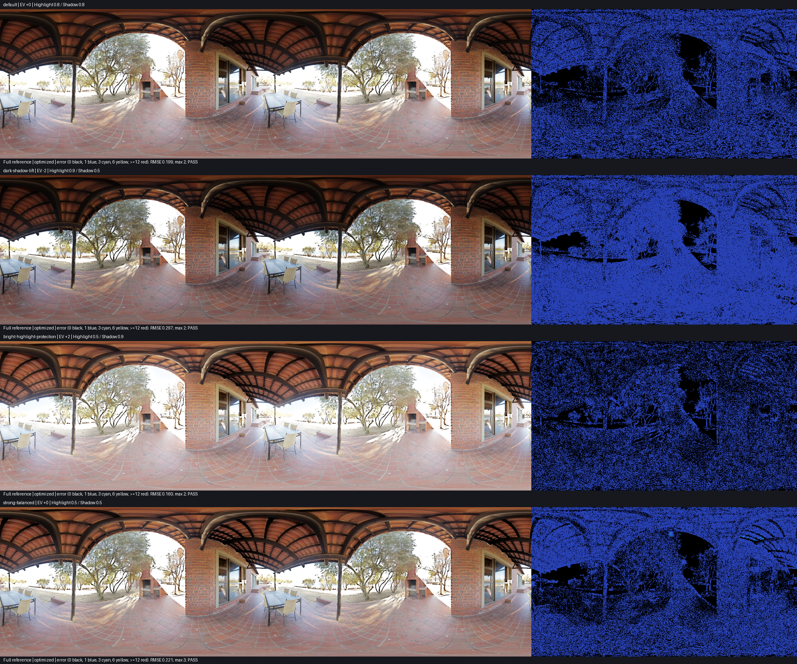
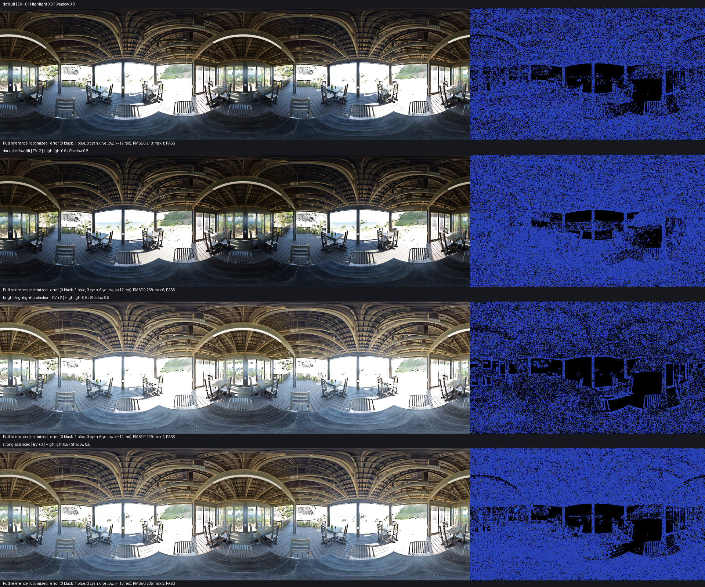
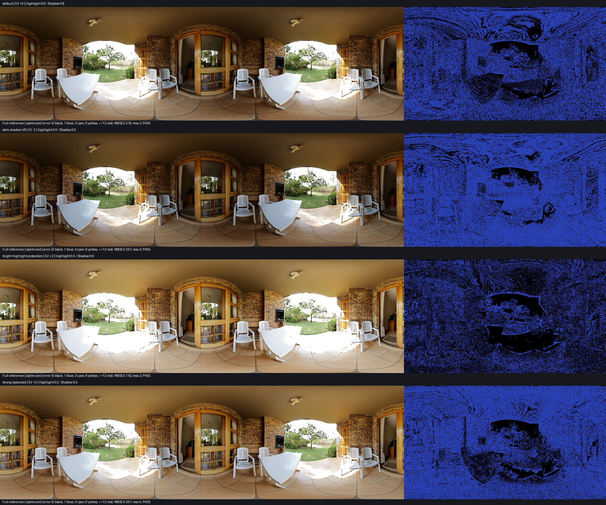

# Asset and parameter validation

Same desktop backend, not phone captures. Independent unfused full pyramid reference; both paths use quarter-width/height Fusion, Guided upsampling and shared calibration.

Result: 16/16 cases pass all fixed gates.

Backend: D3D12, NVIDIA GeForce RTX 5080. 1920×1080 R11G11B10 input, sigma 0.2.

Contrast Scale uses the viewer mapping: bracket magnitude = 6 × (1 − scale) EV.

| Scene | Preset | Global EV | Highlight / Shadow | RMSE | P99 | Max | Pixels >4 (%) | Gate |
| --- | --- | ---: | --- | ---: | ---: | ---: | ---: | --- |
| abandoned_tiled_room_4k | default | +0 | 0.8 / 0.8 | 0.2181 | 1 | 1 | 0.00000 | PASS |
| abandoned_tiled_room_4k | dark-shadow-lift | -2 | 0.9 / 0.5 | 0.2770 | 1 | 2 | 0.00000 | PASS |
| abandoned_tiled_room_4k | bright-highlight-protection | +2 | 0.5 / 0.9 | 0.1564 | 1 | 3 | 0.00000 | PASS |
| abandoned_tiled_room_4k | strong-balanced | +0 | 0.5 / 0.5 | 0.2770 | 1 | 2 | 0.00000 | PASS |
| qwantani_patio_4k | default | +0 | 0.8 / 0.8 | 0.1993 | 1 | 2 | 0.00000 | PASS |
| qwantani_patio_4k | dark-shadow-lift | -2 | 0.9 / 0.5 | 0.2967 | 1 | 2 | 0.00000 | PASS |
| qwantani_patio_4k | bright-highlight-protection | +2 | 0.5 / 0.9 | 0.1595 | 1 | 2 | 0.00000 | PASS |
| qwantani_patio_4k | strong-balanced | +0 | 0.5 / 0.5 | 0.2211 | 1 | 3 | 0.00000 | PASS |
| sundowner_deck_4k | default | +0 | 0.8 / 0.8 | 0.2181 | 1 | 1 | 0.00000 | PASS |
| sundowner_deck_4k | dark-shadow-lift | -2 | 0.9 / 0.5 | 0.2683 | 1 | 6 | 0.00005 | PASS |
| sundowner_deck_4k | bright-highlight-protection | +2 | 0.5 / 0.9 | 0.1791 | 1 | 2 | 0.00000 | PASS |
| sundowner_deck_4k | strong-balanced | +0 | 0.5 / 0.5 | 0.2847 | 1 | 3 | 0.00000 | PASS |
| veranda_4k | default | +0 | 0.8 / 0.8 | 0.2161 | 1 | 2 | 0.00000 | PASS |
| veranda_4k | dark-shadow-lift | -2 | 0.9 / 0.5 | 0.2911 | 1 | 3 | 0.00000 | PASS |
| veranda_4k | bright-highlight-protection | +2 | 0.5 / 0.9 | 0.1422 | 1 | 2 | 0.00000 | PASS |
| veranda_4k | strong-balanced | +0 | 0.5 / 0.5 | 0.2613 | 1 | 5 | 0.00005 | PASS |

Errors are sRGB8 code values. Fixed gates: RMSE ≤0.75, P99 ≤3, max ≤12, pixels >4 ≤0.1%. Numerical gates supplement visual inspection; this is not an exhaustive parameter sweep.

Each overview row shows reference / optimized / absolute error. The error scale is shared across all cases. Worst-pixel crops and source hashes are indexed in [manifest.json](manifest.json). Full-resolution triples are generated locally in `outputs/quality/parameter-matrix`.

## abandoned_tiled_room_4k

## qwantani_patio_4k

## sundowner_deck_4k

## veranda_4k

Regenerate: `python tools/validate_asset_matrix.py`; check freshness: `python tools/validate_asset_matrix.py --check`. All cases run even when a numerical gate fails; the final exit code is nonzero if any case fails.
