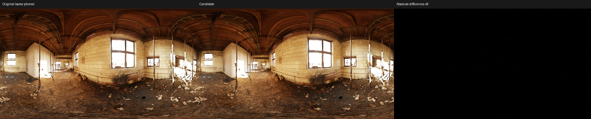
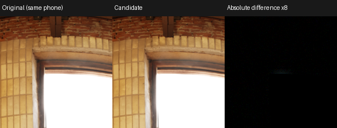
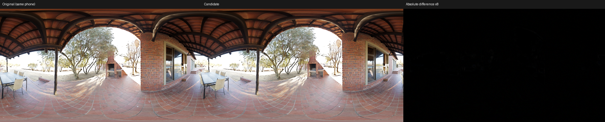
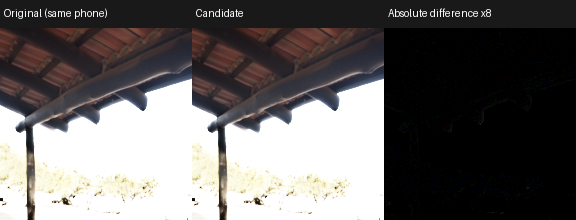
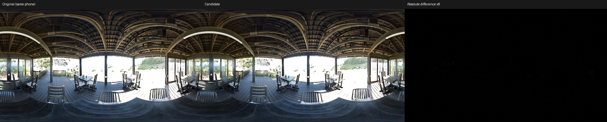
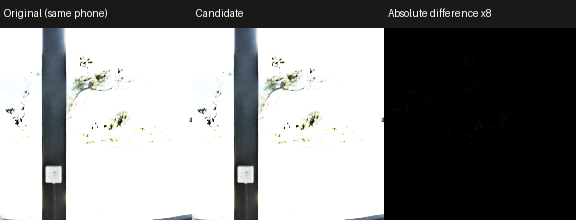
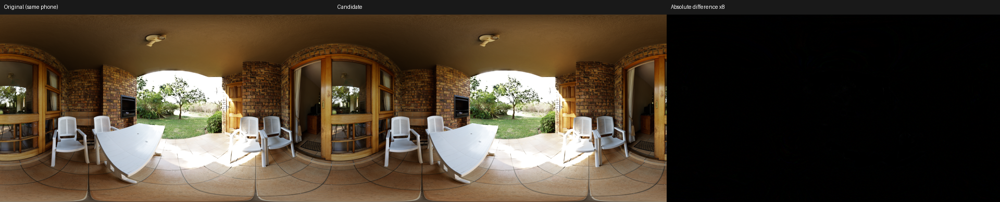
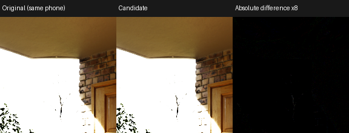

# Mobile optimization goal

Target: incremental texture-sweep traffic <= 1.2 GB/s at 45 FPS and GPU increment <= 1.5 ms, without an obvious visual regression. Measurements use 1080p, R11G11B10 HDR input, an actual RGBA8 sRGB output image and quarter-width/height guided Fusion on Adreno 830. No Adreno 730 phone result is implied.

## Subsequent graphics-context finding

The two-hour follow-up found that the compute-only timing below does **not** represent execution after graphics work. One completed graphics draw produces persistent slower compute execution in this phone process; CPU fence wait increases too. A foreground NativeActivity with a real RGBA8 sRGB surface, graphics precursor and actual blit/present measures **4.9317 ms Fusion, 2.1213 ms matched tonemap, 2.8104 ms incremental** for the same candidate. Its final image is bitwise identical to the headless result. Present without a graphics draw does not reproduce that slowdown. Driver/power-state cause remains unresolved.

The GPU goal is therefore **not established for game integration**. The older tables remain reproducible compute-only records. The 1.026 GB/s number is unchanged nominal texture-sweep accounting, not measured DRAM. The foreground harness is `python -m tools.profiling.android.activity <completed-bundle> --out <new-output>`; presentation is outside core timestamps and uses an additional offscreen-to-swapchain blit.

## Retained candidate

`--variant half-aux-compute` keeps the full 16-sample reduction, both original 5x5 guided windows, FP32 luminance/reconstruction and the fitted curve. It uses RG16F for the two auxiliary weight channels and the final averaged coefficients. The final compute pass explicitly encodes sRGB and writes through a compatible UNORM storage view of an actual sRGB image. There is no extra color copy in the measured path.

```powershell
.\.venv\Scripts\python.exe -m tools.profiling.android.benchmark --variant half-aux-compute --source-format r11g11b10_float --output-format rgba8_srgb --fps 45 --out outputs/android/mobile-candidate
```

The default original graph and lossless `--fused-guided` remain available as controls. `--variant compute-control` runs the full original graph with the same explicit-sRGB compute output, isolating graph/precision changes from the final output backend.

## Integration boundary

The native test uses an offscreen sRGB image with `VK_IMAGE_CREATE_MUTABLE_FORMAT_BIT | VK_IMAGE_CREATE_EXTENDED_USAGE_BIT` and an `R8G8B8A8_UNORM` storage view. A real swapchain requires compatible storage usage and mutable view support; acquire/present and rendering contention are outside this benchmark. Do not apply these compute-only measurements to a renderer that retains the fragment-output path or requires an extra copy. That integration remains to be measured.

[Vulkan swapchain mutable format](https://docs.vulkan.org/refpages/latest/refpages/source/VK_KHR_swapchain_mutable_format.html) explicitly supports compatible sRGB/linear views. [Vulkan storage image rules](https://docs.vulkan.org/guide/latest/storage_image_and_texel_buffers.html) describe the format compatibility requirements. We encode sRGB in the shader because the chosen storage view is UNORM.

## Numerical gates

Every approximate candidate is compared with a separate execution of the full original phone graph and hardware sRGB reference output. Preliminary fixed RGB code-value limits are RMSE <= 0.75, P99 <= 3, maximum <= 12, and at most 0.1% of pixels with any channel error > 4. Intermediate outputs must remain finite. The original lossless gates are retained for lossless runs. These numerical limits are only a screening test; accepted scenes also require whole-image and worst-error crop inspection. Static images do not establish temporal stability.

The desktop portability warning near the inverse curve's white endpoint remains separate from the same-phone candidate comparison. No desktop threshold was widened.

## Rejected experiments

The `reduction4` experiment uses four bilinear samples rather than sixteen; it failed with RMSE 1.61 codes and a 128-code maximum in the tested scene. `radius1` reduces both guided windows to 3x3; it failed with RMSE 3.56 and a 197-code maximum. Combining those with half auxiliary storage (`mobile`) failed with RMSE 4.42 and a 214-code maximum. Their short benchmark records are retained for reproduction; these presets are not accepted production configurations.

## Confirmed results

Each scene uses 60 warmups per block and 360 samples per workload, with alternating workload order. Global EV is zero, exposure brackets are +/-1.2 EV and sigma is 0.2. All four scenes pass the fixed same-phone image gate. Whole-image and worst-error crops show no obvious new halo or lost detail in these static samples; this is not a temporal guarantee.

| Scene | Full chain ms | Tonemap ms | Increment ms | RGB RMSE codes | Max codes |
|---|---:|---:|---:|---:|---:|
| abandoned_tiled_room | 0.9821 | 0.3792 | 0.6029 | 0.211 | 3 |
| qwantani_patio | 0.9707 | 0.3792 | 0.5915 | 0.238 | 5 |
| sundowner_deck | 0.9926 | 0.3792 | 0.6134 | 0.213 | 5 |
| veranda | 0.9647 | 0.3791 | 0.5856 | 0.213 | 4 |

P99 error is one 8-bit code in every scene. Only one pixel exceeds four codes in each of the patio and deck images; neither exceeds five. The other two scenes have no pixel over four. All outputs are finite.

The [incremental sweep ledger](../baselines/adreno830-mobile-traffic.md) gives **22.799448 MB/frame / 1.025975 GB/s at 45 FPS**. This excludes matched tonemap traffic and is not measured DRAM bandwidth. The bandwidth accounting target is met; the earlier compute-only GPU result is superseded for game-integration purposes by the graphics-context finding above.

The matched original-graph compute-output control on the abandoned room measures 1.2502 ms full chain, 0.3792 ms tonemap, and **0.8710 ms incremental**. The retained graph reduces that increment to **0.6029 ms** (about 30.8%). The much larger difference from earlier fragment-output timings is a backend/path effect, not solely Fusion algorithm savings. Its underlying driver/power/scheduling cause has not been isolated, and it must not be extrapolated to an engine that keeps fragment output.

All **45 tests pass**. The six retained compute entries compile for **Adreno 730 with zero scratch usage**, but no 8 Gen 1 device was measured. Raw timing blocks, manifests, image hashes, quality reports and the rejected screening results are archived in [the phone snapshot](../baselines/adreno830-mobile-goal.json); compiler data is in [the A730 snapshot](../baselines/adreno730-mobile-goal.json).

## Image comparisons

Each strip shows the original same-phone result, retained candidate and absolute RGB error amplified eight times. The crop is centered on the worst-error pixel at native resolution.

### abandoned_tiled_room





### qwantani_patio





### sundowner_deck





### veranda





