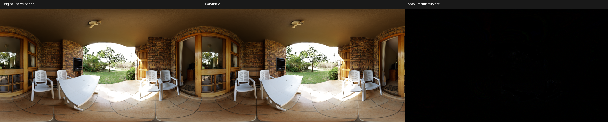
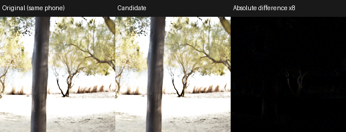

# Two-hour mobile Fusion optimization

Session: 2026-09-24, 00:06–02:06 Hong Kong time. Target: no obvious image degradation, nominal incremental traffic below 1.2 GB/s at 45 FPS, and Local Exposure GPU increment below 1.5 ms. **The measured phone is NX789J / SM8750 / Adreno 830. Adreno 730 / Snapdragon 8 Gen 1 is an offline compilation target only.**

The retained algorithm is `--variant gather-reduction`. It keeps quarter-width/quarter-height Fusion, the full 4x4 source integration and both 5x5 guided windows. It reduces nominal incremental texture traffic to **19.178 MB/frame, or 0.863 GB/s at 45 FPS**. The original graph was 39.901 MB/frame / 1.796 GB/s; the candidate at the start of this session was 22.799 MB/frame / 1.026 GB/s. These values include Fusion intermediates and exclude the matched tonemap input/output traffic. They are **not measured DRAM bandwidth**.

The retained compute-output configuration measured **2.143 ms incremental GPU time in the sustained joint-submission test**, including the same graphics HDR producer in both compared intervals. Separate-submission core measurements across four scenes were 1.95–2.04 ms; those use a different timestamp scope. The bandwidth target is met under the accounting model; **the 1.5 ms timing target remains unmet**. Matched starting-candidate results and output-backend comparisons are recorded below and in the [portable archive](../baselines/adreno830-twohour.json).

## Measured results

All rows use Veranda, 1920x1080, R11G11B10 input, RGBA8 sRGB output and nominal 45 FPS. Values are medians in milliseconds. Each increment subtracts its own matched output-backend baseline.

Separate submissions: intervals exclude the common graphics producer.

| Configuration | Full interval | Matched baseline | Increment |
|---|---:|---:|---:|
| Starting half-aux compute | 4.927 | 2.121 | 2.806 |
| Residual/Gather compute | 4.075 | 2.121 | 1.954 |
| Original graph, fragment output | 4.991 | 0.545 | 4.446 |
| Residual/Gather, fragment output | 2.990 | 0.544 | 2.446 |

Joint submission: intervals include the common graphics producer.

| Configuration | Full interval | Matched baseline | Increment |
|---|---:|---:|---:|
| Starting half-aux compute | 5.443 | 2.513 | 2.930 |
| Residual/Gather compute | 4.642 | 2.507 | 2.135 |
| Residual/Gather, 16x16 regular/output groups | 3.436 | 1.168 | 2.267 |
| Residual/Gather, fragment output | 3.303 | 0.797 | 2.506 |
| FP32 residual alternative | 4.849 | 2.507 | 2.342 |

Larger output groups and fragment output have lower **total** time than the primary 8x8 compute output, but also much faster tonemap baselines. A smaller increment alone does not identify the fastest integrated renderer. Output-mode alternatives have short-run validation; the primary algorithm has the four-scene and sustained coverage.

Sustained joint submissions: 4 alternating AB/BA rounds, 2,700 samples per block and 120 warmup frames. Each preset has 10,800 measured Fusion frames and 10,800 baseline frames.

| Configuration | Full interval | Matched baseline | Increment |
|---|---:|---:|---:|
| Starting half-aux compute | 5.515 | 2.509 | 3.006 |
| Residual/Gather compute | 4.653 | 2.510 | 2.143 |

Starting candidate per-round increments: **3.014, 2.986, 3.011, 3.013 ms**. Framework thermal status samples: [0]. GPU sensor ranges are retained in the JSON archive; they do not establish fixed frequency. Final readback equals the corresponding headless candidate: **True**.

Residual/Gather per-round increments: **2.135, 2.125, 2.185, 2.130 ms**. Framework thermal status samples: [0]. GPU sensor ranges are retained in the JSON archive; they do not establish fixed frequency. Final readback equals the corresponding headless candidate: **True**.

The matched sustained increment falls **28.7%**, from **3.006 to 2.143 ms**. The 1.5 ms target is still **0.643 ms** away. These are descriptive differences of medians on Adreno 830, not frequency-locked causal measurements or 8 Gen 1 predictions.

## Measurement correction

The older compute-only headless result of about 0.6 ms does not predict this phone's graphics workload. One graphics draw changes subsequent compute timings persistently within the same Vulkan process. Presenting without a graphics draw stays fast; adding more draws, using a second queue in the same family, or using the dedicated compute family did not recover the earlier timing. CPU submit/wait durations change too. The cause is unresolved; this is not proof of a driver fault or a particular GPU frequency.

The new foreground NativeActivity writes the actual R11G11B10 source through a graphics attachment every frame, executes Fusion or matched tonemap, and blits/presents the RGBA8 sRGB result. It alternates AB/BA measurement blocks and verifies the final image against the corresponding headless candidate. The separate-submission mode excludes the common graphics producer and presentation from core GPU timestamps. The joint-submission mode includes the same producer in both timestamp intervals and subtracts the matched totals, eliminating the CPU wait between producer and postprocess. Never mix these total-time definitions.

Both modes remain synthetic, paced, static-image workloads. They do not model a complete animated game or prove direct storage access to a swapchain image. Clock controls and hardware DRAM counters are unavailable. Thermal snapshots and block drift are retained rather than assuming fixed clocks.

## Retained changes

1. **Residual pyramid.** Store the highlight and shadow lightness differences from the middle exposure in RG16F. Store their normalized weights in RG16_UNORM. Preserve the finest middle-exposure lightness in R32F and add it back after reconstruction. This avoids quantizing the large common lightness value into half at every scale.
2. **One inverse lookup per low-resolution pixel.** Reconstruct low-resolution lightness and convert to EV once, then let the guided tile read guide + EV. The original fused tile repeated the inverse work in overlapping halos. The inverse remains the calibrated 1024-entry R16F LUT.
3. **Separable guided sums.** Compute horizontal and vertical moments and coefficient averages with the original 5x5 support. Sensitive sums and variance remain FP32; final averaged coefficients use RG16F. Tile-relative guide centering limits cancellation.
4. **Gather-based 4x4 integration.** Four 2x2 quadrants, with RGB component gathers, cover all 16 source pixels. Average linear luminance and log guidance separately. Dimensions not divisible by four use the original sampling fallback. This does not replace the 16 samples with four point samples.
5. **Log-domain exposure conversion.** The compact source stores log luminance; inverse LUT values already represent log luminance. Their difference gives EV without the exp2/divide/log2 round trip. Preserve black and matched-target handling. No exposure-equals-one tonemap reuse shortcut was introduced.

### Why the residual formulation works

Let `Y_m` be the middle exposure, `D_h = Y_h - Y_m`, and `D_s = Y_s - Y_m`. A Laplacian pyramid is linear, and normalized weights satisfy `w_h + w_m + w_s = 1`. At every level:

```text
w_h Lap(Y_h) + w_m Lap(Y_m) + w_s Lap(Y_s)
= Lap(Y_m) + w_h Lap(D_h) + w_s Lap(D_s)
```

Reconstruction of the common `Lap(Y_m)` telescopes to the original finest `Y_m`. Only two weighted difference pyramids need reconstruction. This identity is exact before finite-precision storage; RG16F differences, UNORM weights and changed sum grouping make the implementation approximate. `tests/test_residual_fusion.py` checks the identity with arbitrary linear down/up operators, independently of the shader implementation.

## Quality

The independent original graph runs in a separate phone process. The fixed display-encoded RGB gates were not widened: RMSE ≤0.75 code, P99 ≤3, maximum ≤12, and at most 0.1% of pixels with any channel error over four codes. Retained mip-0 intermediates and averaged coefficients are checked for finite values. These checks do not prove every possible input is perceptually equivalent.

| Scene / exposure | RGB RMSE, codes | P99 | Maximum | Pixels over 4 codes |
|---|---:|---:|---:|---:|
| Veranda, 0 EV | 0.224 | 1 | 8 | 0.00145% |
| Abandoned Tiled Room, 0 EV | 0.218 | 1 | 5 | 0.00072% |
| Qwantani Patio, 0 EV | 0.243 | 1 | 7 | 0.00101% |
| Sundowner Deck, 0 EV | 0.217 | 1 | 8 | 0.00111% |
| Veranda, −4 EV | 0.147 | 1 | 1 | 0% |
| Veranda, +4 EV | 0.177 | 1 | 1 | 0% |

The odd-size and even-size desktop stress suites each cover 15 static scene/exposure cases and 28 moving-edge/textured-ramp frames using packed game-format input. All fixed image gates pass. The largest differential frame-change error is two codes. This is a same-desktop-backend temporal check, not phone animation capture. Natural-scene whole images and native-resolution worst-error crops were inspected; no obvious additional halo was observed in these examples.

**Parameter scope matters.** The retained phone preset uses Sigma=0.2 and ±1.2 EV brackets (Contrast Scale=0.8). Additional desktop tests passed at Sigma=0.2 with zero, ±3 EV and ±6 EV brackets, and at Sigma=0.8 with ±6 EV brackets. However, Sigma=0.05 with ±3 EV brackets fails the error-pixel gate on one moving-edge frame (maximum/temporal error nine codes). Changing averaged coefficients back to FP32 does not fix it; changing the residual pyramid to RG32F does. The diagnostic `gather-floatresidual` passes that test and the Sigma=0.02 / ±6 EV stress case. Do not present the RG16F residual preset as validated for every weight setting, or expose sharp weights in a renderer without revisiting residual precision. The original viewer retains its full-precision reference behavior.

The FP32-residual alternative also passed a Veranda phone comparison (RMSE 0.177 code, maximum four codes). Its short joint-submission increment is **2.342 ms**, with **0.964 GB/s** nominal incremental traffic. It keeps half averaged coefficients and UNORM weights. This is a useful precision option for sharper weights, with narrower phone-scene coverage than the primary preset; it does not meet the 1.5 ms target either.

Original production graph / optimized graph / absolute difference ×8. Both first panels have Local Exposure enabled:





Additional [Abandoned Tiled Room](../../images/twohour/abandoned_tiled_room-comparison.png), [Qwantani Patio](../../images/twohour/qwantani_patio-comparison.png), and [Sundowner Deck](../../images/twohour/sundowner_deck-comparison.png) comparisons are available with matching worst-error crops in the same directory.

## Rejected experiments and tradeoffs

The JSON archive contains individual presets, quality results and measured graphics-context totals. Important outcomes:

| Experiment | Outcome |
|---|---|
| 32x32 guided tile | Slower; A730 reports 72 bytes of scratch. Rejected. |
| Smaller guided groups | More halo work; slower. |
| Source `Load` instead of sampling, cooperative reduction | Slower on this phone. |
| Single-group pyramid tail | No useful timing gain despite fewer dispatches. |
| Packed RGBA16F residual + weights | Weight precision fails the fixed image gate. |
| Packed RGBA16_SNORM | Extreme random HDR at +4 EV reaches 18-code error; rejected. |
| Half guided moment products | Moving-edge tests fail the fixed error-pixel gate; temporal maximum rises to eight codes. |
| Joint bilateral instead of guided filtering | Severe edge/temporal error; rejected. |
| Separate horizontal reduction or moment image | Extra traffic/passes without a useful overall gain. |
| Log-product reduction, half Gather values | No useful speedup. |
| Shared-memory reuse/padding and Gather group reshaping | No stable improvement over the retained layout. |
| Larger regular/output workgroups | Faster complete chain, but a still larger improvement in the matched tonemap baseline. Report both totals and increments. |
| Fragment tonemap output | Useful integration alternative; different baseline and increment. Do not combine its baseline with compute-output totals. |

## Offline target check and reproduction

The remaining low-resolution work is concentrated in guided filtering and source integration. Separate diagnostic intervals on the retained configuration measured about 0.852 ms for the guided tile, 0.587 ms for reduction/setup, and 0.189 ms for reconstruction/inverse EV. These instrumented intervals include dependency effects and must not be added to predict the uninstrumented chain. The output-backend tradeoff above is also material. Further gains need to address these costs while preserving edge behavior; simply shrinking windows or narrowing more arithmetic failed quality checks.

The six retained compute entrypoints compile for A730 with **zero scratch**. AOC reports register footprints 13 / 6 / 3 / 4 / 10 / 3 for Gather setup, downsample, reconstruction, inverse EV, guided filtering and final output respectively. Gather and guided occupancy estimates are 87% and 75%; other entries are 100%. These vendor estimates do not establish 8 Gen 1 frame time. The Gather shader's static instruction count includes both its regular-size and fallback branches, not the instructions dynamically executed by each pixel. See [A730 compiler records](../baselines/adreno730-twohour.json) and the [16x16 output alternative](../baselines/adreno730-twohour-work16.json), also with zero scratch.

The final primary preset's six production SPIR-V binaries and matched baseline are byte-identical to the measured bundle. All 47 repository regression tests pass. Experimental shader branches remain opt-in; preset definitions are isolated in `tools/profiling/android/variants.py`.

Use the [foreground workflow](../android.md#foreground-graphics-context-measurement) to reproduce. `gather-reduction` is the primary compute-output configuration; `gather-work16` and `gather-fragment` expose the documented output-backend tradeoffs. The viewer and default benchmark control remain the independent original graph. Research presets are explicit and must not all be treated as accepted optimizations.

Raw samples, SPIR-V, tool hashes, image readbacks and telemetry are under `outputs/android/twohour/` (ignored by Git). Portable results are in [adreno830-twohour.json](../baselines/adreno830-twohour.json). The original [goal-mode report](mobile-goal.md) remains a historical record, with its compute-only timing limitation stated explicitly.
