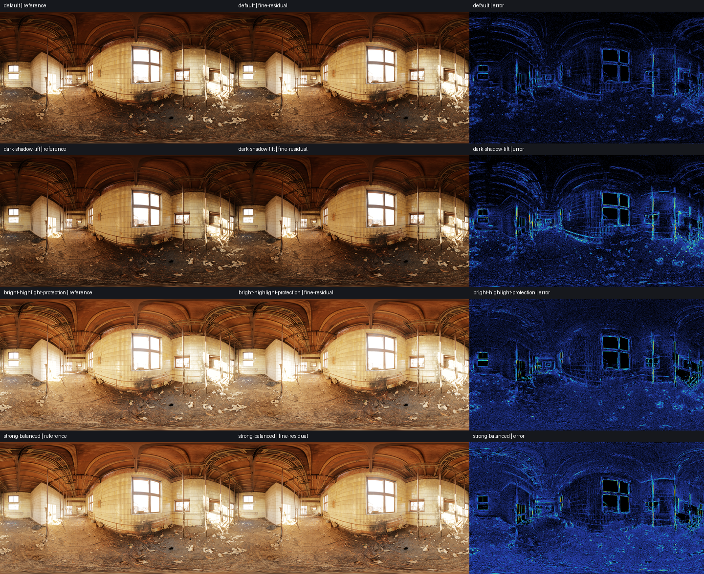
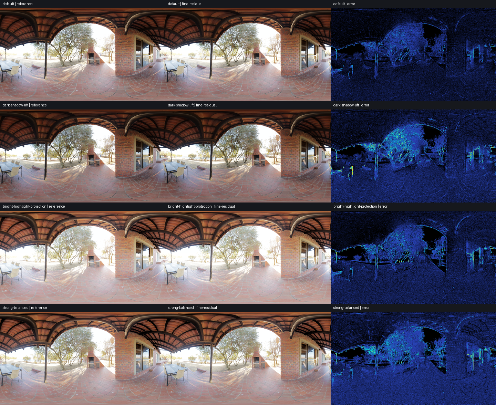
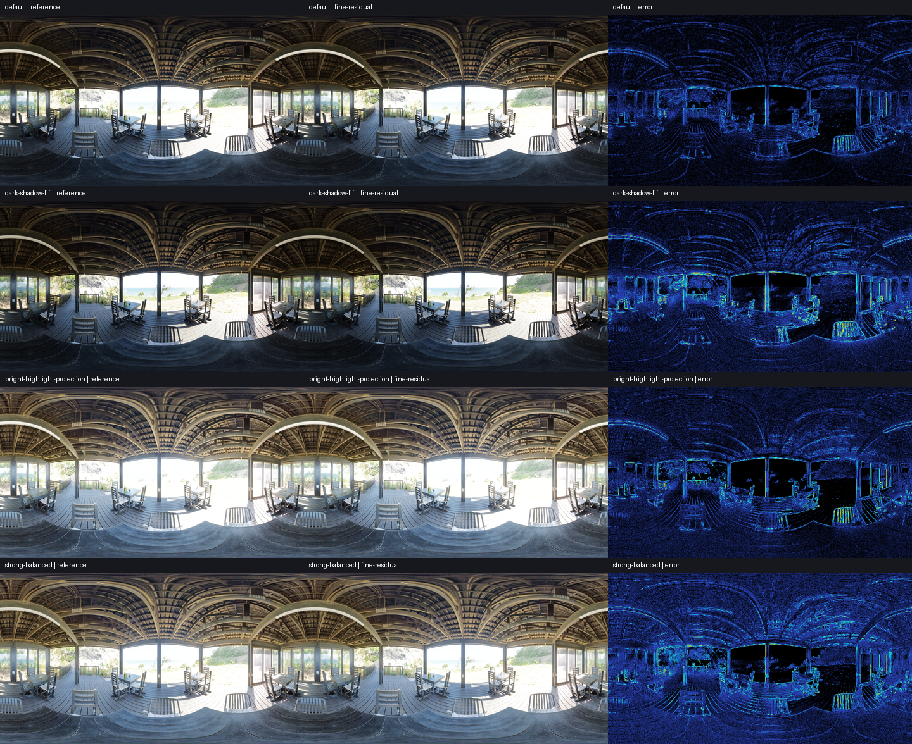
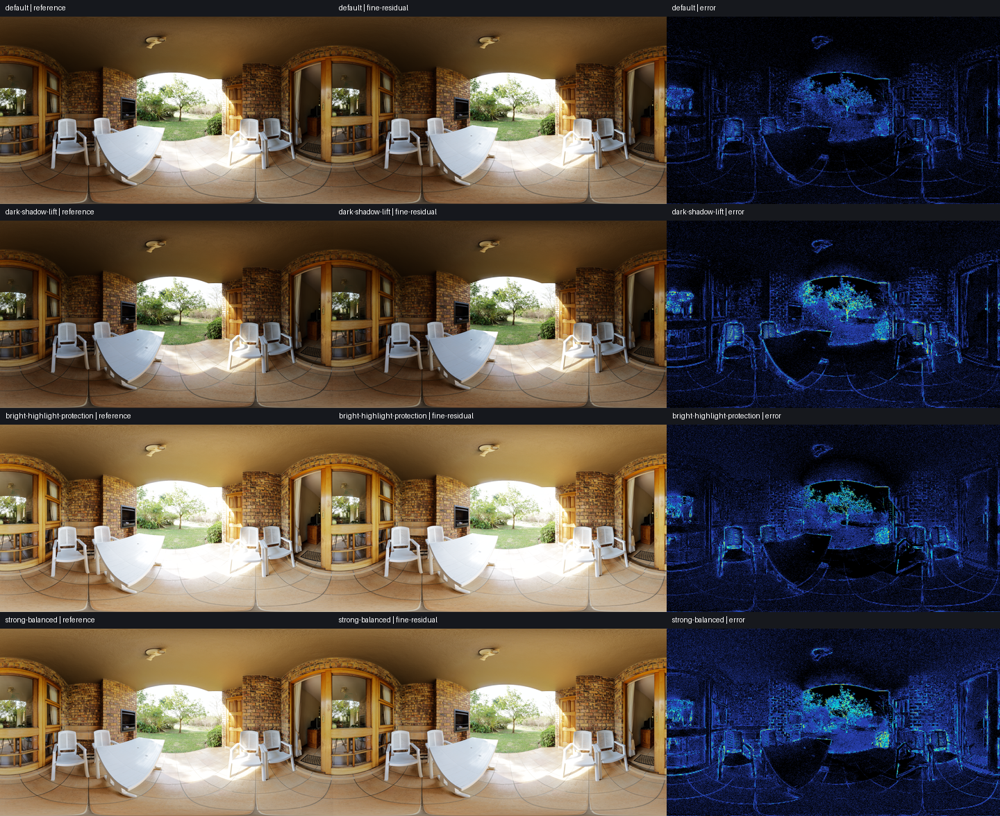
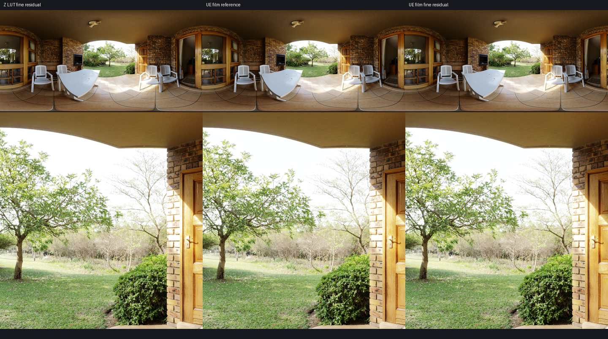
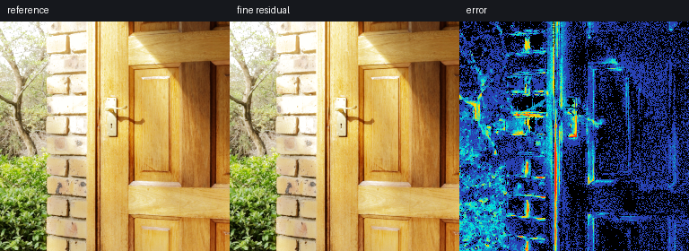

# Analytic UE film in the Bart fine-residual graph

Updated 2026-10-08 for equal-RGB luminance. Optional curve mode, not a change to the calibrated Z default or the
mobile `fine-residual-lookup` benchmark preset.

```sh
python main.py --fusion-curve ue-film --view compare
python main.py --fusion-curve ue-film --fusion-scale 1 --view compare
python main.py --fusion-curve ue-film --ue-film-toe 0.9
```

The viewer's **Bart curve** selector switches between **Calibrated Z (LUT)** and
**UE film (analytic)**. The full-resolution reference supports the same selection.
F5 reload and resolution switching preserve the selected policy. Existing
`--ue-film-slope`, `--ue-film-toe`, `--ue-film-shoulder`, `--ue-film-black-clip` and
`--ue-film-white-clip` flags configure the analytic forward curve.

## Behavior

The analytic path calls the independently audited UE neutral film equations and
fixed inverse from `shaders/unreal/common.slang`. It allocates **no forward or
inverse curve textures**, performs no Z calibration, and does not instantiate
`FusionLookup`. Initialize and final apply evaluate the equations in ALU. The
signed residual pyramids, coarse-to-fine reconstruction and finest-band correction
remain the Bart graph. No additional full-screen pass is introduced.

It preserves the UE upper-only pre-square clamp, fixed inverse coefficients and
lack of a zero-bracket identity shortcut. Changing film parameters does not refit
the inverse. It does **not** add relative bracket bounds, Bart's +/-12 EV limit,
or a new highlight-preservation rule. The inverse's approximately 9.33 maximum
is exposure-domain luminance, not display nits; saturated reconstructed highlights
can still lose luminance differences.

Scope is **curve behavior**, not complete Unreal output: Bart now uses equal-RGB
luminance, adjustable sigma (UE comparison uses 0.2), target 0.5, its floor-sized
mip convention, storage and final common ACES linear-SDR output. The new policy
uses the UE default exposed-luminance floor 2^-8. Other UE graph/luminance/pre-exposure
flags remain settings for `--method ue-fusion` / `ue-bilateral`; they do not alter
the Bart graph. To compare against that independent UE Fusion, use its default equal-RGB metric,
default histogram bounds, pre-exposure 1 and FP32 storage. Power-of-two images
align the otherwise different mip dimension conventions.

## Quality and tests

`tests/test_ue_film_bart.py` checks scalar equations against independent NumPy
definitions with default and custom film parameters (including Toe > 0.8), zero
brackets, EV +/-2, asymmetric 0/6 EV brackets, sigma 0.02/0.8 and luminance from
black to 65535. It also compares the full graph to the independent UE FP32 graph,
checks odd/tiny/edge inputs through the optimized graph, verifies exact production
versus debug colors, and prohibits LUT constructors during mode creation/reload.
FP16 gain storage is accounted for in the reference tolerances.

The targeted analytic/viewer/UE run passes all 15 tests. Full discovery runs 89
tests with 11 failing subcases, 5 errors and 1 expected failure. The 16 failure/error
identifiers exactly match the previously recorded untouched baseline in
`outputs/halo/baseline-tests.log`; there are no added failures. Existing failures
include legacy compact controls and Metal `asuint16` compilation. Full output is
`outputs/ue-film-full-tests.log`. A three-frame Metal viewer startup in analytic
compare mode exits successfully; GUI clicks are covered through callback tests,
not an automated on-screen interaction capture.

The initial Rec.709 validation below is retained as a historical measurement; its
[raw manifest](baselines/ue-film-rec709.json) is preserved. Current equal-RGB quality
and timings are in [the luminance update](equal-rgb-luminance.md). Images below are
regenerated for the current default.

Four scenes × four presets at 1920×1080 pass the existing red-pixel gate
(error >=12 sRGB8 codes on <1% of pixels). This is not proof of perceptual
equivalence: maximum observed single-channel error is 26 codes, worst RMSE is
0.7900, and maximum red fraction is 0.01196%. Some cases fail the older stricter
max-error gate; both outcomes are preserved in the manifest.

Native 4096×2048 Veranda at highlight 0.524 / shadow 0.8 gives RMSE 0.5732,
P99 2 codes, maximum 21 codes, red fraction 0.01129%. Visual inspection includes
the roof/sky, foliage and door edges and the worst-error native crop. Fine residual
remains an approximation; sparse fine-edge errors remain visible in the heatmap.

Each matrix row is reference / fine residual / error, and rows are default,
dark-shadow-lift, bright-highlight-protection and strong-balanced:






Native edge comparison: original Z fine residual / analytic film reference /
analytic film fine residual. The Z-to-film difference is an intentional change in
curve behavior, not an optimization error.




## Measured GPU scope

Apple M4 Pro, Metal, macOS 26.3; SlangPy 0.43.1. The driver is bundled with the OS;
no separate revision was queried. Static RGBA32F HDR EXRs, shared ACES and RGBA16F
linear-SDR output. Eight warmups followed by 60 randomized interleaved rounds.
Whole-command GPU timestamps; incremental Local Exposure time subtracts the
same-round global-only baseline. No GUI, display, debug writes, uploads,
readback or compilation in the timing. No per-pass sums, bandwidth estimates,
compiler projections or phone/game measurements are reported.

The Z-LUT versus UE-analytic comparison changes **both curve behavior and execution**.
It is not an isolated benchmark of ALU against texture lookup, and cannot establish
that ALU is free. The original samples and P10/P90 are in the
[Rec.709 manifest](baselines/ue-film-rec709.json); the
[current manifest](../images/ue-film/manifest.json) uses equal RGB.

| Workload | Z LUT chain (ms) | UE analytic chain (ms) | Z Local Exposure increment (ms) | UE Local Exposure increment (ms) |
| --- | ---: | ---: | ---: | ---: |
| abandoned_tiled_room_4k-1920x1080 | 0.4288 | 0.4330 | 0.2225 | 0.2298 |
| qwantani_patio_4k-1920x1080 | 0.4280 | 0.4341 | 0.2161 | 0.2279 |
| sundowner_deck_4k-1920x1080 | 0.4352 | 0.4422 | 0.2231 | 0.2318 |
| veranda_4k-1920x1080 | 0.4800 | 0.4818 | 0.2633 | 0.2659 |
| veranda_4k-4096x2048 | 1.5039 | 1.5584 | 0.6996 | 0.7357 |

These measurements show a small but nonzero cost in some workloads. The native
Veranda whole chain increases by about 0.055 ms in this run. No performance-neutral
claim is made for the optional policy; the original default remains available.

## Reproduce

```sh
python -m unittest tests.test_ue_film_bart tests.test_fine_residual_viewer tests.test_unreal_local_exposure
python tools/profiling/compare_ue_film.py
python tools/profiling/compare_ue_film.py --check
python tools/render_comparison.py
python tools/validate_asset_matrix.py
```

Full-size reference / optimized / error PNGs are generated under `outputs/ue-film`;
checked-in previews and source/image hashes are in `docs/images/ue-film`.
