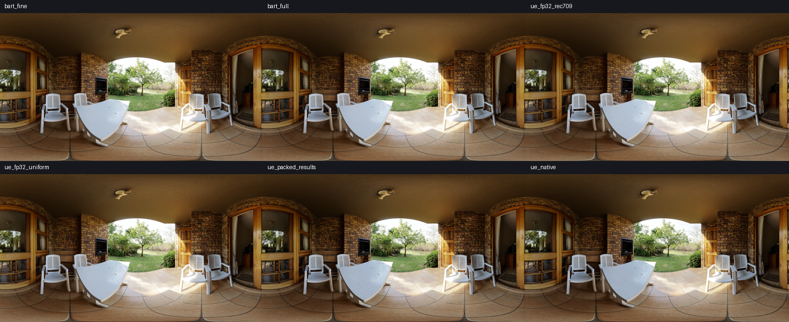

# Why the UE Fusion preset is darker with matched film curves

2026-10-08. Quality diagnosis on Apple M4 Pro / Metal (SlangPy 0.43.1,
macOS 26.3). This concerns the repository's standalone UE port on this backend,
not an Unreal Editor frame capture or a claim about all GPU write conversions.
No runtime shaders, presets or defaults were changed for this analysis.

Input: native 4096×2048 `veranda_4k.exr`, RGBA32F. Global EV 0, Highlight Contrast
0.5 (−3 EV bracket), Shadow Contrast 0.8 (+1.2 EV bracket), sigma 0.2, default UE
film parameters. All cases use the same final ACES and SDR output. The power-of-two
image aligns the full-resolution Bart and UE mip dimensions. Bart uses the analytic
UE-film policy. Gain statistics exclude pixels with maximum input RGB ≤1e-5.

## Controlled results

| Change | Mean change in local EV | sRGB8 RGB RMSE |
| --- | ---: | ---: |
| Bart fine residual → Bart full | +0.00357 | 0.5814 |
| Bart full → UE FP32, Rec.709 | −0.00000008 | 0.0955 |
| UE FP32 Rec.709 → equal RGB weights | +0.00010 | 1.1058 |
| UE FP32 equal weights → native packed storage | −0.22903 | 7.1416 |
| Bart fine residual → UE native default | −0.22536 | 7.0836 |

The full-resolution analytic curves and independent UE FP32 graph agree to at most
one output code in this case (Bart stores its final gain in FP16; UE uses FP32).
Rec.709 versus equal RGB weighting matters locally, particularly in colored
regions, but does not explain the broad darkening in this scene. Quarter-resolution
approximation is also much smaller than the packed-storage effect.

With all other stages FP32, changing only one stage chain to R11G11B10 gives:

| Packed chain | Mean change from UE FP32 (EV) |
| --- | ---: |
| Three-exposure luminance pyramid | −0.01728 |
| Weight pyramid | −0.03128 |
| Reconstructed fusion result at each level | −0.19085 |
| All three chains | −0.22903 |

These are independent ablations, not additive contributions. Interactions between
quantization, normalized weights, reconstruction and inverse mapping prevent
simple summation. With all native chains, 98.82% of evaluated pixels lose more
than 0.05 EV relative to UE FP32. The median difference is −0.1690 EV.

## Mechanism and backend limits

The audited UE source allocates `PF_FloatRGB` for exposure and weight textures;
reconstruction inherits that format. Its Metal mapping is RG11B10Float. The port
preserves this choice. R/G have six explicit mantissa bits and B has five, whereas
FP16 has ten and FP32 has twenty-three. In this graph the channels hold base,
dark and bright exposures, so the bright channel has the lower precision.

A separate 4097-value ramp from 0.1 to 1.04 was written once to R11G11B10 through
the existing `pack_source` shader, then decoded from the packed bytes. On this
backend, 99.90% of R/G samples and 99.93% of B samples decreased, with no positive
errors. Mean errors were −0.003036 (R/G) and −0.006037 (B). This demonstrates a
one-sided write-conversion bias in the tested path, not merely generic symmetric
rounding noise. Do not assume every API/compiler/device uses this conversion.

Repeated stores in the downsample and reconstruction chains shift the fused
lightness. The final native reconstructed lightness averages 0.02368 below the
FP32 result. The monotone inverse turns that into lower HDR targets and therefore
lower exposure multipliers. The fixed inverse's nonlinear sensitivity affects the
size of the change, but a mismatched analytic film formula is not the source here.

Native `Texture.to_numpy()` returns packed bytes for R11G11B10 on this backend;
the diagnostic explicitly decodes unsigned float channels before stage statistics.
Color and gain metrics use decoded floating-point output textures.

## Visual comparison

Top: Bart fine residual / Bart full / UE FP32 Rec.709.
Bottom: UE FP32 equal RGB / only packed reconstruction / UE native default.



For algorithm comparison, use UE FP32 and matching Rec.709 luminance. Keep the
native format as a separate fidelity/performance control. Applying a global darkening
compensation to Bart would conceal a storage effect and would not reproduce the
spatially and luminance-dependent error. No implementation change is made here.

```sh
python tools/profiling/analyze_ue_darkening.py
python main.py --fusion-curve ue-film --ue-storage fp32 --ue-luminance-method rec709 --highlight-contrast 0.5 --shadow-contrast 0.8
```

The second command allows switching algorithms under the matched settings; select
full resolution for the closest graph comparison. Full-size pictures and raw output
are under `outputs/ue-darkening`; the checked-in [report](baselines/ue-darkening.json)
contains all ablations, per-mip errors, the store probe and source hashes. No timing
or bandwidth claims are made by this experiment.

## Rechecked after switching Bart to equal RGB (2026-10-08)

The same native Veranda / EV 0 / Highlight 0.5 / Shadow 0.8 experiment was rerun
with both Bart and UE using equal RGB. Only UE storage changes between native and
FP32; there is no extra exposure compensation. Results confirm the storage cause:

| Comparison | Mean local EV difference | sRGB8 RMSE | Maximum channel difference |
| --- | ---: | ---: | ---: |
| Bart full → UE FP32 | +0.000000083 | 0.0956 | 1 |
| Bart fine residual → UE FP32 | +0.00365 | 0.6096 | 22 |
| Bart fine residual → UE native | −0.22538 | 7.0325 | 55 |

The broad darkening disappears with FP32. Remaining quarter-resolution differences
are spatial approximation errors; full resolution leaves only small numerical
differences, including Bart's FP16 final gain. No claim is made that all individual
pixels match or that native storage behaves identically on other backends.


[Raw results and source hashes](baselines/ue-fp32-equal-rgb.json). Reproduce with
`python tools/profiling/analyze_ue_darkening.py --out outputs/ue-fp32-verification`.
The Rec.709 panel is now an intentionally different metric, not the matched reference.
