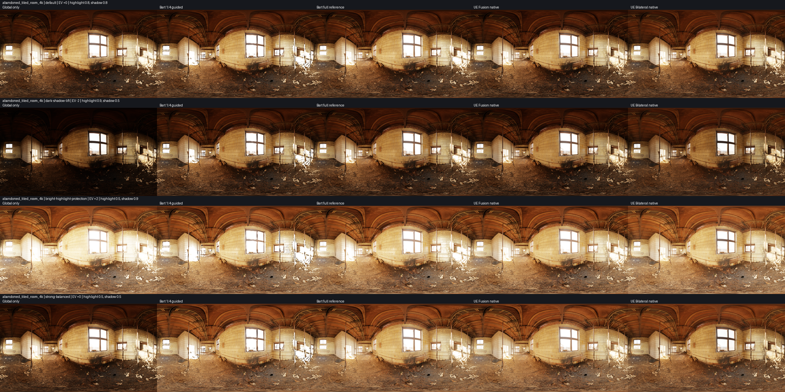
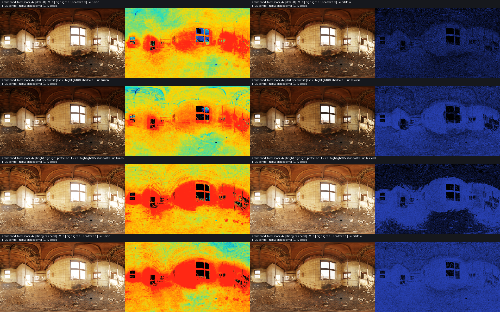
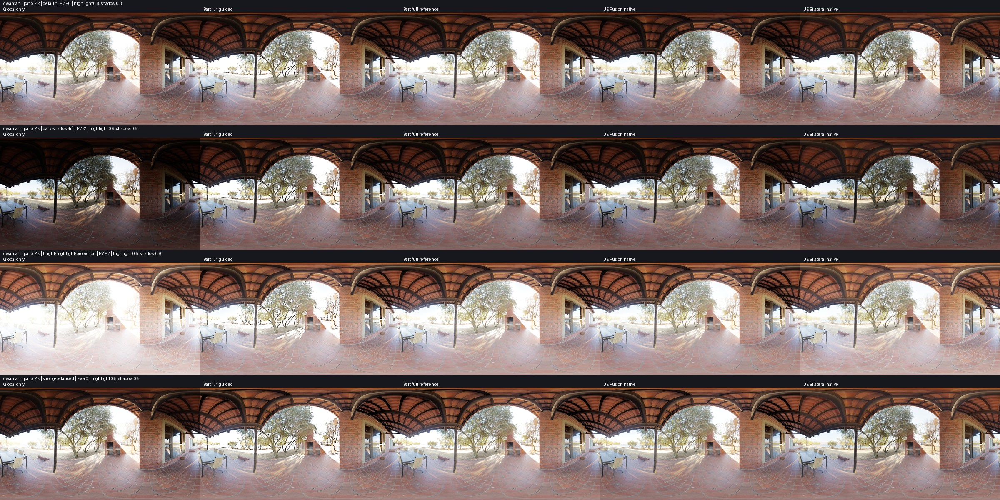
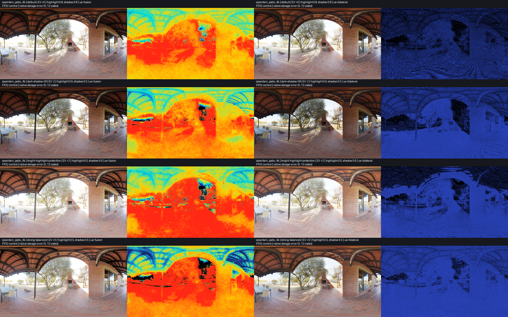
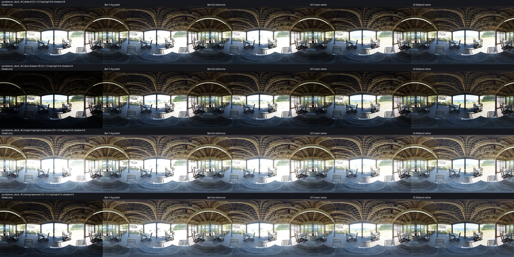
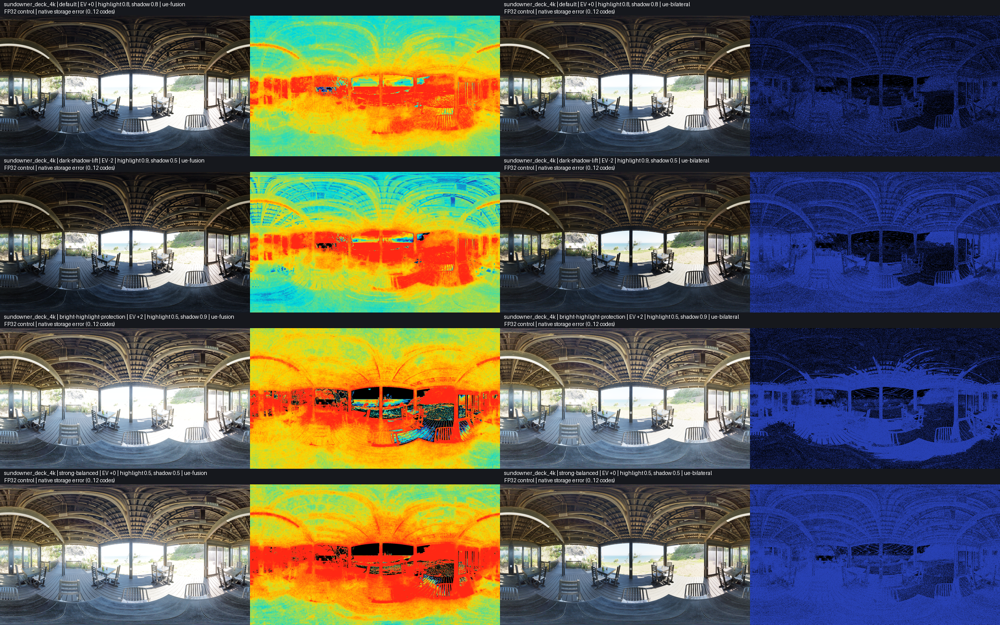
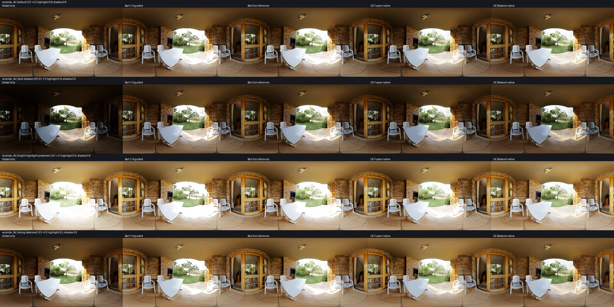
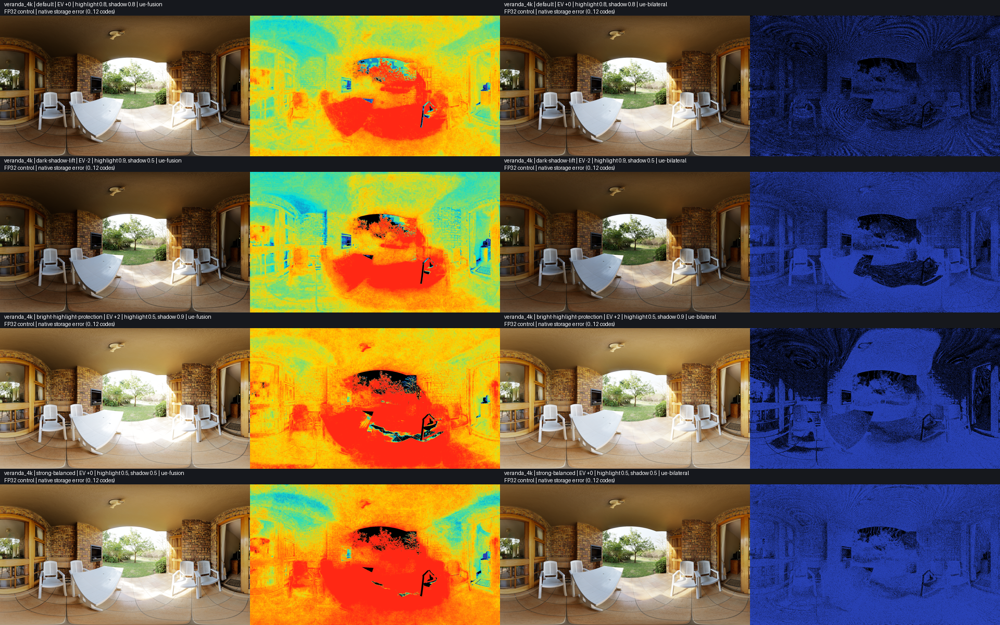

# Bart / UE 5.8 comparison

Measured on Apple M4 Pro (20 GPU cores), Metal, macOS 26.3 build 25D125, SlangPy 0.43.1 / Python 3.14.3. The Metal driver is supplied by this OS build; no separate driver version was queried. These are standalone ports on static HDR EXRs, not Unreal engine or phone captures.

## Matched GPU measurement

1920×1080 R11G11B10 HDR input, default EV 0 / highlight and shadow 0.8, 16-level cap, common ACES output in RGBA16F linear SDR. UE desktop profile and native storage. Five warmup submissions per graph, then 30 randomized, interleaved rounds per scene. Every graph recomputes all passes. HDR uploads, compilation, allocation, calibration, diagnostic writes, sRGB display, GUI and presentation are excluded. The complete chain is Local Exposure plus final ACES, including UE desktop scene reductions; it excludes HDR production.

Metal timestamp queries are unavailable in this SlangPy backend. `gpu_timer.py` retains the actual MTLCommandBuffer through the RHI callback, waits for completion, and reads GPUStartTime/GPUEndTime. These are GPU durations, not CPU wall-clock estimates. Other backends use RHI timestamp queries when supported; their timing path has not been hardware-validated here. Native command-buffer timings include execution/barrier overhead within the submission. No diagnostic pass timings are added together.

The incremental duration subtracts the same-round global-only baseline. Shared tonemapping improvements are not credited to Local Exposure. Raw samples, P10/P90 and source/artifact hashes are retained in [manifest.json](../images/unreal/manifest.json). Single-submission, warm-cache measurements are a screening comparison, not sustained game frame budgets.

| Scene | Algorithm | Complete chain median (ms) | Increment median (ms) |
| --- | --- | ---: | ---: |
| abandoned_tiled_room_4k | baseline | 0.1084 | — |
| abandoned_tiled_room_4k | bart-guided | 0.3586 | 0.2501 |
| abandoned_tiled_room_4k | bart-full | 1.4714 | 1.3629 |
| abandoned_tiled_room_4k | ue-fusion | 0.5888 | 0.4799 |
| abandoned_tiled_room_4k | ue-bilateral | 0.1965 | 0.0884 |
| qwantani_patio_4k | baseline | 0.1085 | — |
| qwantani_patio_4k | bart-guided | 0.3552 | 0.2462 |
| qwantani_patio_4k | bart-full | 1.4736 | 1.3654 |
| qwantani_patio_4k | ue-fusion | 0.5870 | 0.4780 |
| qwantani_patio_4k | ue-bilateral | 0.1946 | 0.0870 |
| sundowner_deck_4k | baseline | 0.1090 | — |
| sundowner_deck_4k | bart-guided | 0.3593 | 0.2498 |
| sundowner_deck_4k | bart-full | 1.4705 | 1.3623 |
| sundowner_deck_4k | ue-fusion | 0.5892 | 0.4799 |
| sundowner_deck_4k | ue-bilateral | 0.1952 | 0.0866 |
| veranda_4k | baseline | 0.1087 | — |
| veranda_4k | bart-guided | 0.3577 | 0.2482 |
| veranda_4k | bart-full | 1.4712 | 1.3614 |
| veranda_4k | ue-fusion | 0.5879 | 0.4794 |
| veranda_4k | ue-bilateral | 0.1969 | 0.0874 |

Bart guided and full are the isolated legacy Guided control and independent full-resolution reference. The viewer now defaults to `fine-residual-lookup`, which is not timed in this historical table; see [current viewer measurements](viewer-halo.md). UE Bilateral is the fastest tested graph; UE Fusion is faster than full-resolution Bart here, but slower than quarter-resolution Bart. Algorithms, storage and effect differ, so this is not a quality-matched optimization claim. No GPU bandwidth is measured or estimated by this tool.

## Images and precision controls

Each overview shows global-only, Bart guided, Bart full, UE Fusion native and UE Bilateral native. Rows are default, dark-shadow-lift, bright-highlight-protection and strong-balanced. All use the same packed HDR texture and final ACES operator. Bart/UE differences are intentional algorithm differences, not reference error. Full-resolution PNGs are generated under `outputs/unreal/comparison/`.

Precision sheets show FP32 control / native-versus-FP32 maximum RGB error for each UE method. Heatmaps use a fixed 0..12 sRGB8-code scale; previews are resized, while metrics use full-resolution pixels. FP32 controls keep the same equations and grid fixed-point packing but change intermediate texture storage. They are not Unreal ground truth.

| Scene | Preset | Fusion RMSE / max codes | Fusion ≥12 area (%) | Bilateral RMSE / max codes |
| --- | --- | ---: | ---: | ---: |
| abandoned_tiled_room_4k | default | 6.234 / 51 | 9.616 | 0.379 / 1 |
| abandoned_tiled_room_4k | dark-shadow-lift | 5.938 / 46 | 5.995 | 0.564 / 1 |
| abandoned_tiled_room_4k | bright-highlight-protection | 7.966 / 45 | 21.368 | 0.537 / 2 |
| abandoned_tiled_room_4k | strong-balanced | 8.371 / 61 | 22.257 | 0.650 / 2 |
| qwantani_patio_4k | default | 7.664 / 33 | 15.743 | 0.448 / 1 |
| qwantani_patio_4k | dark-shadow-lift | 7.621 / 38 | 11.489 | 0.658 / 2 |
| qwantani_patio_4k | bright-highlight-protection | 9.230 / 50 | 38.670 | 0.659 / 2 |
| qwantani_patio_4k | strong-balanced | 8.505 / 40 | 22.527 | 0.743 / 2 |
| sundowner_deck_4k | default | 6.141 / 59 | 8.011 | 0.392 / 1 |
| sundowner_deck_4k | dark-shadow-lift | 6.144 / 70 | 9.840 | 0.573 / 3 |
| sundowner_deck_4k | bright-highlight-protection | 7.056 / 52 | 10.801 | 0.558 / 2 |
| sundowner_deck_4k | strong-balanced | 8.102 / 75 | 19.216 | 0.693 / 3 |
| veranda_4k | default | 6.354 / 44 | 10.773 | 0.403 / 1 |
| veranda_4k | dark-shadow-lift | 6.294 / 37 | 9.142 | 0.596 / 2 |
| veranda_4k | bright-highlight-protection | 8.055 / 79 | 20.709 | 0.594 / 2 |
| veranda_4k | strong-balanced | 8.714 / 58 | 21.107 | 0.688 / 2 |

Native Fusion differs substantially from its FP32 control (maximum 79 codes across these cases). Repeated unsigned R11G11B10 reconstruction/weight storage is retained for source fidelity; these are not presented as negligible rounding errors. Native Bilateral differs by at most three codes in this asset matrix. This comparison includes all changed intermediate formats, rather than isolating a single store. Extreme HDR noise, out-of-range histogram positions and signed reconstruction can behave differently; the port intentionally preserves the audited packing/clamping conventions.

The existing Bart reference/optimized matrix was regenerated on Metal: 16/16 pass the unchanged red-area gate, worst red area 0.02170%. This differs slightly from historical desktop rounding. The Metal compatibility define maps `asuint16` to `f32tof16` for already-rounded half coefficients in the quality tools; finite values and signed zero retain their half bits, while NaN payload preservation is not claimed. Frozen shader files remain unchanged. Four production parity subcases for the historical compact Guided controls fail against the frozen graph on Metal; their backend-specific cause is unresolved. Those controls are not used in the timing table, and this run does not claim their Metal parity. The current fine-residual asset gate and its edge tests pass separately (one documented extreme-edge expected failure).

## Reproduce

Validation on 2026-10-05/06: 26 UE/viewer/pyramid/guided/benchmark checks passed; both production-graph checks passed, including every finite half bit pattern and same-texture content changes. Fine-residual edge checks passed with one existing expected extreme-edge failure. The historical compact parity test failed four subcases: packed-coefficient and FP32-layout variants at 128×64 / −2 EV / packed input, and 513×289 / +2 EV / FP32 input. Reproduce these unresolved failures with `python -m unittest tests.test_compact_production`; they are retained rather than waived. Headless UE Fusion and mobile Bilateral renders and a three-frame Metal Bilateral window startup completed. Interactive method-switch clicks were not visually verified by the UI automation in this run.

```sh
python tools/profiling/compare_unreal.py
python tools/profiling/compare_unreal.py --check
python tools/profiling/compare_unreal.py --ue-profile mobile --out outputs/unreal/mobile
python -m unittest tests.test_unreal_local_exposure tests.test_production_graph
```

The mobile profile selects input resolutions; executing it on a desktop GPU is not a phone performance measurement. An unavailable or invalid GPU timer raises an error instead of substituting CPU timing. [Implementation and source audit](../unreal-local-exposure.md) describe manual eye adaptation, neutral-film math and the final-tone-mapper difference from Unreal.

## abandoned_tiled_room_4k





## qwantani_patio_4k





## sundowner_deck_4k





## veranda_4k




