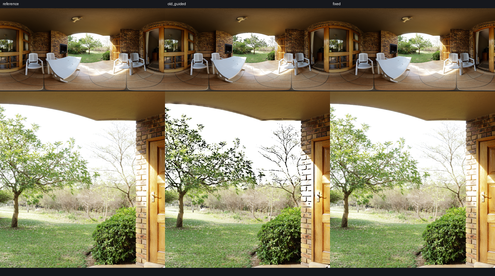
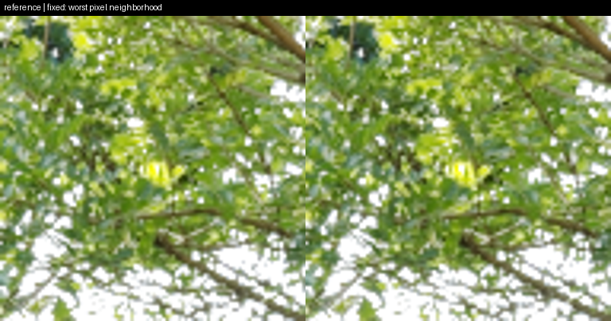

# Viewer halo diagnosis and default-path correction

On 2026-10-06, the interactive Bart viewer was still selecting the former
quarter-resolution Guided graph, while the documented mobile default already
used `fine-residual-lookup`. The screenshot therefore did not show the validated
optimized implementation. The default now uses `FineResidualToneMapper`, sharing
the retained mobile stage shaders and storage. Full-resolution Fusion remains
an independent selectable reference.

The old Guided branch, its resource allocation and shader compilation have been
removed from application code. `ToneMapper` now accepts only `fusion_scale=1`.
The frozen historical host/shader are isolated under
[`tools/profiling/controls/`](../../tools/profiling/controls/README.md); regression
and benchmark tools explicitly opt into them. The application imports no profiling
code and has no old-Guided selector or fallback.

## Reproduction and where the error enters

Source: original `veranda_4k.exr`, **4096×2048 RGBA32F**, global EV 0,
highlight contrast **0.524** (2.856 EV darker bracket), shadow contrast **0.8**
(1.2 EV brighter bracket), sigma 0.2. Both paths share calibration, ACES,
RGBA16F linear output and sRGB8 conversion. Metrics are native-pixel measurements,
not measurements of the reduced screenshot or resized previews.

1. **Initialization:** the old graph averages linear HDR over a 4×4 footprint
   before evaluating nonlinear lightness and exposure weights. Near bright/dark
   edges, `F(mean(L))` differs from `mean(F(L))`; the low-resolution weights also
   differ. An upsampler cannot recover the discarded per-pixel exposure choices.
2. **Exposure recovery and upsampling:** the old graph inverts reconstructed
   lightness at low resolution, fits `EV = a * logL + b` over 5×5 windows, averages
   those coefficients over another 5×5 window and applies them to full-resolution
   luminance. This omits the fine Fusion bands and extrapolates a local linear
   fit across sharp HDR contrasts. The screenshot's dark foliage and edge halos
   are visible here.
3. **Retained correction:** fine residual keeps lightness residuals through the
   low-resolution pyramid, restores a weighted fine-band approximation using
   full-resolution luminance/weights, then inverts at full resolution. Its
   initialization evaluates nonlinear lightness/weights at four bilinear samples
   before averaging. No Guided fit or coefficient-average pass is dispatched.

A diagnostic ablation keeps the old average-HDR-first initialization while using
the new residual graph and full-resolution apply. It is an attribution experiment,
not a shipped alternative, and includes LUT/packed-storage differences from the
old graph. It separates the two groups of changes, not every arithmetic operation.

| Native 4K path | RGB RMSE, sRGB8 codes | P99, codes | Pixels with max RGB error ≥12 |
| --- | ---: | ---: | ---: |
| Former viewer Guided | 8.4677 | 38 | 2.75302% |
| Average-HDR-first + fine-residual apply (ablation) | 1.2121 | 6 | 0.22635% |
| Current fine-residual default | **0.6210** | **3** | **0.01696%** |

Most error in this scene disappears when fine-band restoration and inversion move
to full resolution; evaluating lightness/weights before averaging further reduces
error. This does not attribute the entire error to coefficient precision or to
bilinear sampling alone. The unchanged independent reference and calibration
exclude a shared tonemapper change as the source of this improvement.



## Matched measured GPU time

**Apple M4 Pro / Metal, macOS 26.3, SlangPy 0.43.1**. Apple supplies the Metal
driver with the OS; a separate driver revision is not exposed by this runtime.
Native `MTLCommandBuffer.GPUStartTime/GPUEndTime` durations, 8 warmups and 60
randomly interleaved submissions per path. Every timed frame recomputes all
processing passes. The baseline reads the same HDR texture and uses the same
ACES operator and RGBA16F output. Compilation, allocation, calibration/LUT rebuilds,
readback, GUI, comparison/EV outputs and display are excluded.

| Workload | Path | Complete processing chain, median ms | LE increment, median ms |
| --- | --- | ---: | ---: |
| Native 4096×2048 | Global-only baseline | 0.8226 | — |
| Native 4096×2048 | Former Guided | 2.0233 | 1.1740 |
| Native 4096×2048 | Fine residual | **1.5037** | **0.6693** |
| Bilinear-resized 1920×1080 | Global-only baseline | 0.2017 | — |
| Bilinear-resized 1920×1080 | Former Guided | 0.6839 | 0.4707 |
| Bilinear-resized 1920×1080 | Fine residual | **0.4372** | **0.2319** |

Incremental medians subtract the baseline from each matched round; they need not
exactly equal the difference of medians. At native 4K, the measured LE increment
falls about **43%**, and the whole chain about **26%**. A preceding run also favored
the new path: native 4K 1.1387 → 0.6668 ms increment and 1.9322 → 1.4577 ms chain;
1080p 0.3613 → 0.1967 ms increment and 0.5588 → 0.3948 ms chain. No per-pass timings
are summed, and there is no measured DRAM-bandwidth claim.

These are static desktop EXR measurements, not matched graphics-produced game
workloads or new phone measurements. The historical phone results remain in
[quality-goal.md](quality-goal.md). The production fine-residual math is unchanged;
this fix adds a matching viewer host and diagnostic apply wrapper.

[Retained final raw samples, settings and source hashes](baselines/viewer-halo.json).

## Validation and limits

- 23 targeted checks pass: runtime parity, reference selection, removed-path
  rejection, hot reload, caching, production/diagnostic parity, same-texture content
  changes, pyramid/reference numerics, calibration and window surface handling.
- Fine-residual runtime output is exactly equal to the existing optimized control
  in 18 size/parameter cases, including 1×1, 3×2, 65×1, 33×35, 513×289 and 1920×1080,
  asymmetric 0–6 EV brackets, sigma 0.02/0.2/0.8, and global EV −2/0/+2.
- The refreshed four-scene/four-preset 1080p matrix checks exact runtime/control
  parity as well as error against the independent full-resolution reference.
  Reference/optimized/error images remain generated with fixed scales and gates.
- Full discovery runs 85 tests with 11 failing subcases, 5 errors and 1 expected
  failure. An untouched HEAD snapshot runs 81 tests with the **identical failure
  identifiers and expected failure**. These failures are historical compact/Guided
  controls, including five Metal `asuint16` compilation errors; no thresholds or
  skips were changed to hide them. Logs are under `outputs/halo/`.
- Native 4K still has **1,423 pixels** at error ≥12, including **two pixels** ≥100
  (maximum 195) around subpixel foliage/sky detail. The widespread dark outlines
  are corrected; this is not universal pixel equivalence. The worst-pixel crop is
  shown below. At resized 1080p for this screenshot preset, RMSE is 0.5109, maximum
  17 and red area 0.001013%. Existing extreme synthetic-edge/noise limitations in
  [quality-goal.md](quality-goal.md) remain.



## Reproduce

```sh
.venv/bin/python tools/profiling/diagnose_halo.py
.venv/bin/python -m unittest tests.test_fine_residual_viewer tests.test_production_graph tests.test_pyramid tests.test_zcurve tests.test_viewer_surface
.venv/bin/python tools/render_comparison.py
.venv/bin/python tools/validate_asset_matrix.py
.venv/bin/python tools/render_comparison.py --check
.venv/bin/python tools/validate_asset_matrix.py --check
.venv/bin/python main.py --view compare --highlight-contrast .524 --shadow-contrast .8
```

`diagnose_halo.py` stores native triples, heatmaps, the initialization ablation and
all raw timing samples under `outputs/halo/`. Close other active GPU viewers before
collecting timing samples. Timing excludes diagnostic images and the ablation.
